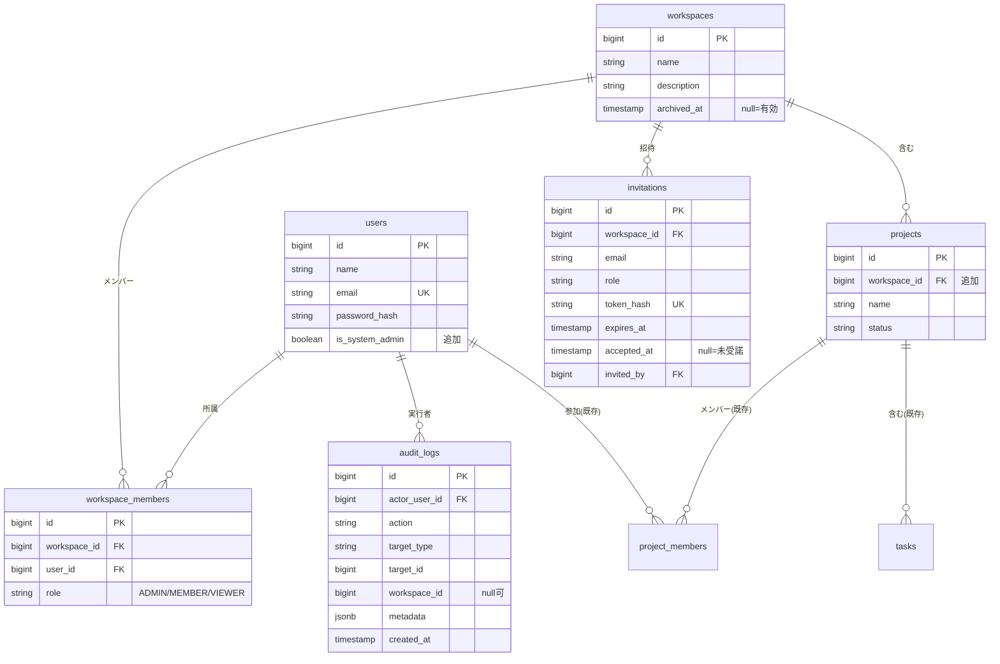

# Phase 2 M1 基本設計: ワークスペース/チーム土台

Phase 2 のマイルストーン M1 の基本設計。社内のチーム/部署を「ワークスペース」で分け、可視性・権限を分離する土台を作る。

- 関連: [Phase 2 要件定義](../../docs/phase2/requirements.md) / [ADR 0001 ワークスペース方式](../../docs/phase2/adr/0001-workspace-model.md)
- 方式（決定済み）: 1 インスタンス = 1 組織、共有 DB＋`workspace_id`、ロール 3 スコープ

---

## 目次

- [1. 目的と範囲](#1-目的と範囲)
- [2. データモデル](#2-データモデル)
- [3. 認可設計（3 スコープ）](#3-認可設計3-スコープ)
- [4. 招待・ユーザー追加](#4-招待ユーザー追加)
- [5. System Admin と監査ログ](#5-system-admin-と監査ログ)
- [6. API 設計の変更](#6-api-設計の変更)
- [7. 画面への影響](#7-画面への影響)
- [8. 初期データ/セットアップ](#8-初期データセットアップ)
- [9. テスト方針](#9-テスト方針)
- [10. 実装順序（M1 内の分解）](#10-実装順序m1-内の分解)
- [11. 未決事項](#11-未決事項)

---

## 1. 目的と範囲

M1 で作るもの：

- **ワークスペース**（チーム/部署）と**メンバー/ロール**
- **プロジェクトのワークスペース所属**（可視性の境界）
- **3 スコープの認可**（System / Workspace / Project）と可視性制御
- **招待＋ユーザー追加 API**
- **System Admin**（インスタンス全体の管理）
- **監査ログ**（重要操作の記録・開始）

M1 では扱わない（後続マイルストーン）：カンバン等の UX（M2）、通知/リアルタイム（M3）、Git 連携（M4）、指標/配布（M5）。

---

## 2. データモデル

### 2.1 変更の概要

| 区分 | テーブル | 変更 |
| --- | --- | --- |
| 追加 | `workspaces` | ワークスペース本体 |
| 追加 | `workspace_members` | ワークスペース所属＋ロール |
| 追加 | `invitations` | 招待（メールトークン） |
| 追加 | `audit_logs` | 監査ログ |
| 変更 | `projects` | `workspace_id`（FK, NOT NULL）を追加 |
| 変更 | `users` | `is_system_admin`（boolean, default false）を追加 |

### 2.2 ER 図



### 2.3 テーブル定義（主要カラム）

**workspaces**

| カラム | 型 | 備考 |
| --- | --- | --- |
| id | bigserial | PK |
| name | varchar(100) | NOT NULL |
| description | varchar(500) | NULL 可 |
| archived_at | timestamptz | NULL=有効、値あり=アーカイブ |
| created_at / updated_at | timestamptz | 既定 CURRENT_TIMESTAMP |

**workspace_members**

| カラム | 型 | 備考 |
| --- | --- | --- |
| id | bigserial | PK |
| workspace_id | bigint | FK → workspaces |
| user_id | bigint | FK → users |
| role | varchar(20) | `ADMIN` / `MEMBER` / `VIEWER` |
| created_at | timestamptz | |

- 一意制約：`(workspace_id, user_id)`
- インデックス：`workspace_id`、`user_id`

**projects（変更）**

| カラム | 型 | 備考 |
| --- | --- | --- |
| workspace_id | bigint | FK → workspaces、**NOT NULL** |

- インデックス：`workspace_id`

**invitations**

| カラム | 型 | 備考 |
| --- | --- | --- |
| id | bigserial | PK |
| workspace_id | bigint | FK → workspaces |
| email | varchar(255) | 招待先 |
| role | varchar(20) | 付与するワークスペースロール |
| token_hash | varchar(255) | **トークンはハッシュで保存**（平文は保存しない） |
| expires_at | timestamptz | 失効時刻 |
| accepted_at | timestamptz | NULL=未受諾（受諾で一度きり） |
| invited_by | bigint | FK → users |
| created_at | timestamptz | |

- 一意制約：`token_hash`
- 補助インデックス：`(workspace_id, email)`

**audit_logs**

| カラム | 型 | 備考 |
| --- | --- | --- |
| id | bigserial | PK |
| actor_user_id | bigint | FK → users（実行者） |
| action | varchar(100) | 例：`workspace.member.role_changed` |
| target_type | varchar(50) | 例：`workspace` / `project` / `user` |
| target_id | bigint | 対象 ID |
| workspace_id | bigint | 文脈のワークスペース（NULL 可） |
| metadata | jsonb | 変更前後など（秘密情報は入れない） |
| created_at | timestamptz | |

- インデックス：`created_at`、`workspace_id`、`actor_user_id`

> `users.email` の一意制約は従来どおり（1 インスタンス内でメールは一意）。

---

## 3. 認可設計（3 スコープ）

### 3.1 スコープと判定順

アクセス判定は次の順で評価する。

1. **System**：`users.is_system_admin = true` なら全操作可（監査ログに記録）。
2. **Workspace**：対象プロジェクトが属するワークスペースの `workspace_members.role`。所属なしなら**非所属扱い＝ 404**（存在を開示しない。Phase 1 の方針を踏襲）。
3. **Project**：既存 `project_members.role`（OWNER/MEMBER）。プロジェクトの管理操作を細かく制御。

### 3.2 可視性ルール

- **プロジェクトの可視性はワークスペース所属で決まる**：所属ワークスペースのプロジェクトは（ロールに関わらず）見える。所属していないワークスペースのプロジェクト・タスク・コメントは既定で**返さない（404）**。
- `project_members`（OWNER/MEMBER）は Phase 1 を維持するが、役割は「プロジェクトのオーナー/担当管理」に変わる（可視性の門番はワークスペースへ移す）。

### 3.3 権限マトリクス

| 操作 | System Admin | WS Admin | WS Member | WS Viewer |
| --- | --- | --- | --- | --- |
| ワークスペース作成 | ✓ | － | － | － |
| ワークスペース設定/アーカイブ | ✓ | ✓ | － | － |
| メンバー招待/追加/削除/ロール変更 | ✓ | ✓ | － | － |
| プロジェクト作成 | ✓ | ✓ | ✓ | － |
| プロジェクト編集/削除 | ✓ | ✓ | プロジェクト OWNER のみ | － |
| タスク作成/編集/削除 | ✓ | ✓ | ✓ | － |
| コメント投稿 | ✓ | ✓ | ✓ | － |
| 閲覧（PJ/タスク/コメント） | ✓ | ✓ | ✓ | ✓ |

- **Viewer は常に読み取り専用**（プロジェクトロールに関わらず書き込み不可）。
- プロジェクト編集/削除は **プロジェクト OWNER または WS Admin（または System Admin）**。

### 3.4 既存 `ProjectAccess` の拡張方針

Phase 1 の `ProjectAccess`（認可の集約点）を、**ワークスペース所属を前段に組み込む**形に拡張する。

- `GetProjectRoleAsync(projectId, userId)` を、まず**プロジェクトが属するワークスペースの所属を確認**し、所属があれば `workspace_role` と `project_role` の両方を返す形にする（所属なしは null＝404）。
- 判定ヘルパ（例）：`ResolveAccess(userId, projectId) → { isSystemAdmin, workspaceRole, projectRole }` を 1 箇所に集約し、各サービスはこの結果で許可を判断する（判定漏れ防止）。
- EF Core の **クエリ段階でワークスペース所属に絞る**（アプリ側フィルタだけに頼らない）。一覧・詳細ともに所属外を SQL で除外し、取りこぼしを防ぐ。
- System Admin は絞り込みを緩める（全件可）が、その参照・操作は監査ログに残す。

---

## 4. 招待・ユーザー追加

### 4.1 フロー

```
[WS Admin / System Admin]
   │ 招待作成（email, role）
   ▼
invitations にレコード作成（token を生成しハッシュで保存、期限付き）
   │ 招待メール送信（本文に token を含むリンク）
   ▼
[招待された人] リンクを開く → token を提示
   ├─ 既存ユーザー: ワークスペースにメンバー追加
   └─ 新規ユーザー: アカウント作成（パスワード設定）→ メンバー追加
   ▼
accepted_at を記録（以後そのトークンは無効＝一度きり）
```

### 4.2 トークン設計

- トークンは**十分な長さのランダム値**を生成し、**ハッシュ（例：SHA-256）にして `token_hash` に保存**（平文は保存しない。Phase 1 のリフレッシュトークンと同方針）。
- **期限**（例：7 日）と**ワンタイム**（`accepted_at` で消費）。
- 失効・使用済み・不一致はいずれも同じ「無効」応答にして、存在を推測させない。

### 4.3 API（M1 範囲）

| メソッド | パス | 権限 | 概要 |
| --- | --- | --- | --- |
| POST | `/api/workspaces/{wsId}/invitations` | WS Admin / System Admin | 招待作成（メール送信） |
| GET | `/api/invitations/{token}` | 認証不要（トークン） | 招待の有効性確認（表示用） |
| POST | `/api/invitations/{token}/accept` | トークン＋（新規は登録情報） | 受諾（ユーザー作成/メンバー追加） |
| GET | `/api/workspaces/{wsId}/members` | WS メンバー | メンバー一覧 |
| POST | `/api/workspaces/{wsId}/members` | WS Admin / System Admin | 既存ユーザーをメンバー追加（＝ユーザー追加 API） |
| PATCH | `/api/workspaces/{wsId}/members/{userId}` | WS Admin / System Admin | ロール変更 |
| DELETE | `/api/workspaces/{wsId}/members/{userId}` | WS Admin / System Admin | メンバー削除 |

> メール送信は M1 では最小実装（AWS: SES、自己ホスト: SMTP の抽象化。[要件定義 8 章](../../docs/phase2/requirements.md) の運用形態に合わせる）。

---

## 5. System Admin と監査ログ

### 5.1 System Admin

- `users.is_system_admin` フラグで表す（インスタンス全体＝テナント横断）。
- **初回の System Admin** は、セットアップ時の初期ユーザーに付与する（Phase 1 の初期ユーザー投入の仕組み＝マイグレーション Lambda / 自己ホストの初期化で `is_system_admin=true` を設定）。
- System Admin の付与/剥奪も監査対象。

### 5.2 監査ログの記録対象（M1）

| カテゴリ | 例 |
| --- | --- |
| ワークスペース | 作成・設定変更・アーカイブ |
| メンバー | 追加・削除・ロール変更 |
| 招待 | 作成・受諾 |
| プロジェクト | 削除（重要操作） |
| System Admin | 付与/剥奪、横断アクセスの実施 |

- 記録は**非同期でも同期でも可**だが、**失敗しても本処理を止めない**設計（監査は後追いで良いが欠落は最小化）。
- `metadata` に変更前後を入れる場合も**秘密情報（トークン等）は入れない**。

---

## 6. API 設計の変更

### 6.1 ルーティング方針

既存のプロジェクト/タスク系はワークスペース配下に移し、**所属を URL で明示**する。

| 変更前（Phase 1） | 変更後（M1） |
| --- | --- |
| `GET /api/projects` | `GET /api/workspaces/{wsId}/projects` |
| `POST /api/projects` | `POST /api/workspaces/{wsId}/projects` |
| `/api/projects/{id}` 系 | 既存どおり（ID から所属ワークスペースを解決し認可） |

- タスク・コメント等は従来どおりプロジェクト/タスク ID 配下。ID から所属ワークスペースを解決し、§3 の判定を通す。
- 加えて、横断用に **`GET /api/me/workspaces`**（自分の所属ワークスペース一覧）、**`GET /api/me/tasks`**（My Tasks の土台）を用意。

### 6.2 新規エンドポイント（一覧）

- ワークスペース：`GET/POST /api/workspaces`、`GET/PATCH /api/workspaces/{wsId}`、`POST /api/workspaces/{wsId}/archive`
- メンバー/招待：§4.3 のとおり
- 自分：`GET /api/me/workspaces`

---

## 7. 画面への影響

- **ワークスペース切替 UI**（ヘッダ等）：現在のワークスペースを選び、以降の一覧をそのワークスペースに絞る。
- **ワークスペース管理画面**：メンバー一覧・招待・ロール変更（WS Admin 以上）。
- **招待受諾画面**：トークン付きリンクから、新規はアカウント作成、既存は参加。
- 既存のプロジェクト/タスク画面：取得先がワークスペース配下に変わる（表示は概ね踏襲）。
- Viewer は編集 UI を出さない（ボタン非活性/非表示）。

---

## 8. 初期データ/セットアップ

- 要件どおり**既存の運用データは無い前提**（移行なし）。スキーマ変更（テーブル追加・列追加）のみ適用する。
- 新規インストール時：
  - **デフォルトワークスペースを 1 つ作成**（プロジェクトは必ずワークスペースに属するため）。
  - **初期ユーザーに `is_system_admin=true`** を付与し、デフォルトワークスペースの Admin として所属させる。
- デモデータ（M0）：デフォルトワークスペースに、デモ用のプロジェクト/タスク/メンバーを投入する。

---

## 9. テスト方針

Phase 1 の UT/API/結合/画面/セキュリティ方針を踏襲。M1 は**可視性と認可を重点的に**テストする。

| 観点 | 代表ケース |
| --- | --- |
| 可視性分離 | WS-A のメンバーは WS-B のプロジェクト/タスク/コメントを取得できない（404） |
| ロール権限 | Viewer は編集/削除/コメントが 403、Member はプロジェクト削除が 403（OWNER/WS Admin のみ可） |
| 招待/追加権限 | 招待・メンバー追加・ロール変更は WS Admin / System Admin のみ |
| 招待トークン | 期限切れ・使用済み・不一致はいずれも無効（同一応答） |
| System Admin | 横断アクセスが可能、かつ**監査ログが記録される** |
| 監査ログ | 重要操作（メンバー変更・プロジェクト削除等）で記録が作られる |
| クエリ分離 | 一覧取得が SQL 段階で所属ワークスペースに絞られている（アプリ側フィルタ頼みにしない） |

---

## 10. 実装順序（M1 内の分解）

1. スキーマ（migration）：`workspaces` / `workspace_members` / `invitations` / `audit_logs`、`projects.workspace_id`、`users.is_system_admin`
2. 認可の集約（`ProjectAccess` 拡張＝`ResolveAccess`）と**クエリ段階の可視性フィルタ**
3. ワークスペース CRUD ＋ メンバー管理 API
4. 招待フロー（トークン生成/保存/受諾）＋ メール送信（抽象化）
5. 既存プロジェクト/タスク API のワークスペース配下への移設＋認可適用
6. System Admin（フラグ・初期付与）＋ 監査ログ
7. 画面：ワークスペース切替・管理・招待受諾
8. 初期セットアップ（デフォルトワークスペース・初期 System Admin）
9. テスト（可視性・認可・招待・監査）

---

## 11. 未決事項

- **ワークスペース内の可視性の粒度**：本設計は「WS メンバーは WS 内の全プロジェクトを閲覧可」とする。将来「WS 内でもプロジェクト単位に閲覧制限」が必要になれば拡張する。
- **メール送信基盤**：AWS は SES、自己ホストは SMTP。抽象化（`IEmailSender`）の詳細は M1 で最小実装、M3 の通知で拡張。
- **ワークスペース切替の保持方法**：URL パス（`/api/workspaces/{wsId}/...`）を正とし、画面側の選択状態の持ち方（Cookie/状態管理）は画面設計で確定する。
