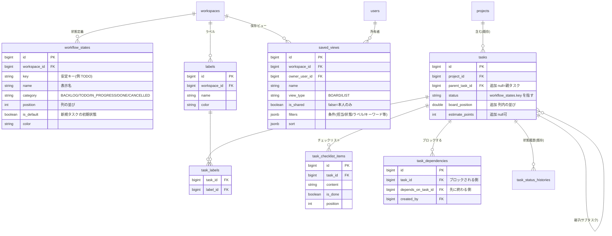

# Phase 2 M2 基本設計: 日常 UX

Phase 2 のマイルストーン M2 の基本設計。M1 で作ったワークスペース境界・3 スコープ認可の上に、**開発チームが日常的に快適に使える UX** を載せる。固定の TODO/IN_PROGRESS/DONE に縛られないワークフロー、カンバン、検索/保存ビュー、My Tasks、サブタスク/依存、一括操作、コマンドパレットを対象とする。

- 関連: [Phase 2 要件定義](../../docs/phase2/requirements.md)（§5.4・5.5・6） / [M1 基本設計](./m1-workspace.md) / [ADR 0001 ワークスペース方式](../../docs/phase2/adr/0001-workspace-model.md)
- 前提（M1 で確定済み）: 可視性・認可はワークスペース所属で決まる（非所属は 404）。認可の集約点は `ProjectAccess.ResolveAccessAsync` / `WorkspaceAccess.ResolveWorkspaceAccessAsync`、一覧は `WhereVisibleTo` で SQL 段階から絞る。M2 の新機能もすべてこの土台に載せる。

> **実装状況: ✅ M2 完了（2026-10）**。§15 の 10 ステップをすべて PR 単位で実装・マージ済み（単体／API／画面 E2E をグリーンにしてから統合）。データアクセスはユーザー方針により**生 SQL を使わず EF Core LINQ** で実装（キーワード検索は `EF.Functions.ILike` でパラメータ化、並べ替えキーはホワイトリスト）。主な PR: ワークフロー基盤・カンバン・ラベル/見積・検索/保存ビュー・My Tasks（#104〜#111 周辺）／サブタスク・チェックリスト（#112）／サブタスク可視化（#114, 罫線描画の修正 #116）／タスク依存（#115）＋未完ブロッカー時の完了確認モーダル（#117）／一括操作（#118）／コマンドパレット（#119）。各状態変更は `task_status_histories` に履歴を残す。スキーマ変更を伴う PR はマージ後にマイグレーション用 Lambda を手動実行して有効化する。

---

## 目次

- [1. 目的と範囲](#1-目的と範囲)
- [2. データモデル](#2-データモデル)
- [3. カスタムワークフロー（状態定義）](#3-カスタムワークフロー状態定義)
- [4. カンバンボード（ドラッグ&ドロップ）](#4-カンバンボードドラッグドロップ)
- [5. 検索・絞り込み・並べ替え＋保存ビュー](#5-検索絞り込み並べ替え保存ビュー)
- [6. My Tasks](#6-my-tasks)
- [7. サブタスク／チェックリスト／タスク依存](#7-サブタスクチェックリストタスク依存)
- [8. ラベル・見積・一括操作](#8-ラベル見積一括操作)
- [9. コマンドパレット](#9-コマンドパレット)
- [10. API 設計の変更](#10-api-設計の変更)
- [11. 画面への影響](#11-画面への影響)
- [12. マイグレーション方針](#12-マイグレーション方針)
- [13. 認可・可視性との関係](#13-認可可視性との関係)
- [14. テスト方針](#14-テスト方針)
- [15. 実装順序（M2 内の分解）](#15-実装順序m2-内の分解)
- [16. 未決事項](#16-未決事項)

---

## 1. 目的と範囲

M2 で作るもの：

- **カスタムワークフロー**：タスクの状態（カラム）をワークスペース単位で定義できる（固定 3 状態に縛られない）
- **カンバンボード**：状態列 × ドラッグ&ドロップ、楽観的更新
- **リストビュー＋検索・絞り込み・並べ替え**（担当者/状態/優先度/期限/ラベル/キーワード）
- **保存ビュー**：絞り込み条件を保存して再利用、URL で共有
- **My Tasks**：自分の担当・期限間近・期限超過（M1 の `GET /api/me/tasks` を発展）
- **サブタスク／チェックリスト／タスク依存**（ブロック/被ブロック）
- **ラベル・見積（ポイント）・一括操作**
- **コマンドパレット（Cmd/Ctrl+K）**

M2 では扱わない（後続マイルストーン）：@メンション・通知・リアルタイム・計画（サイクル/バックログ/マイルストーン）は M3、Git 連携は M4、指標ダッシュボード/配布は M5。

### 1.1 設計の指針

- **M1 の可視性・認可を壊さない。** 追加するテーブル・API はすべてワークスペース境界の内側に閉じ、`WhereVisibleTo` と `ResolveAccessAsync` を経由する。横断参照は従来どおり System Admin のみ。
- **既存 API の後方互換を保つ。** Phase 1 からの `tasks.status`（`"TODO"` 等の文字列）や既存のタスク一覧レスポンス形状は壊さず、段階的に拡張する（§3.2・§12）。
- **既存の資産を再利用する。** 状態遷移は既に用意済みの `task_status_histories` に記録する。画面は既存の共通コンポーネント（Button / Select / Modal / Loading / ErrorMessage）を使い、カンバンの DnD のみ新規に追加する。
- **書き込みは Viewer に出さない。** M1 の `CanWrite`（Viewer は読み取り専用）を全操作に適用する。

---

## 2. データモデル

### 2.1 変更の概要

| 区分 | テーブル | 変更 |
| --- | --- | --- |
| 追加 | `workflow_states` | ワークスペースごとの状態（カンバンのカラム）定義 |
| 追加 | `labels` | ワークスペースごとのラベル |
| 追加 | `task_labels` | タスク × ラベル（多対多） |
| 追加 | `task_checklist_items` | タスク内のチェックリスト項目 |
| 追加 | `task_dependencies` | タスク間の依存（ブロック関係） |
| 追加 | `saved_views` | 保存ビュー（絞り込み条件＋並び＋表示種別） |
| 変更 | `tasks` | `parent_task_id`（サブタスク）、`board_position`（並び順）、`estimate_points`（見積）を追加。`status` は `workflow_states.key` を指す運用に移行 |

### 2.2 ER 図（M2 追加分）

### 2.3 テーブル定義（主要カラム）

**workflow_states**

| カラム | 型 | 備考 |
| --- | --- | --- |
| id | bigserial | PK |
| workspace_id | bigint | FK → workspaces |
| key | varchar(50) | 安定キー（例 `TODO`）。API/履歴の `status` 値に使う |
| name | varchar(100) | 表示名（例「対応中」） |
| category | varchar(20) | `BACKLOG` / `TODO` / `IN_PROGRESS` / `DONE` / `CANCELLED`。指標・完了判定の意味づけ（M5 で利用） |
| position | int | カンバンの列の並び |
| is_default | boolean | 新規タスクの初期状態（WS につき 1 件 true） |
| color | varchar(20) | 列の色（任意） |

- 一意制約：`(workspace_id, key)`
- `category` は固定集合。`DONE`/`CANCELLED` を「完了扱い」とし、一覧の既定表示や指標で使う。

**labels**

| カラム | 型 | 備考 |
| --- | --- | --- |
| id / workspace_id | bigserial / bigint | PK / FK → workspaces |
| name | varchar(50) | NOT NULL |
| color | varchar(20) | 表示色 |

- 一意制約：`(workspace_id, name)`

**task_labels**（多対多）

| カラム | 型 | 備考 |
| --- | --- | --- |
| task_id | bigint | FK → tasks（ON DELETE CASCADE） |
| label_id | bigint | FK → labels（ON DELETE CASCADE） |

- 複合主キー `(task_id, label_id)`

**tasks（変更）**

| カラム | 型 | 備考 |
| --- | --- | --- |
| parent_task_id | bigint | FK → tasks、NULL=親タスク。**同一プロジェクト内・1 階層のみ**（サブタスクはさらに子を持てない） |
| board_position | double precision | 同一 `(project_id, status)` 内の並び順。DnD で更新 |
| estimate_points | int | NULL 可。見積ポイント |

- `status` は従来どおり文字列カラムのまま、値は**そのタスクが属するワークスペースの `workflow_states.key` のいずれか**に限定する（§3.2）。
- インデックス：`parent_task_id`、`(project_id, status, board_position)`

**task_checklist_items**

| カラム | 型 | 備考 |
| --- | --- | --- |
| id / task_id | bigserial / bigint | PK / FK → tasks（CASCADE） |
| content | varchar(500) | 項目の内容 |
| is_done | boolean | 既定 false |
| position | int | 並び順 |

**task_dependencies**

| カラム | 型 | 備考 |
| --- | --- | --- |
| id | bigserial | PK |
| task_id | bigint | ブロックされる側（`depends_on_task_id` の完了を待つ） |
| depends_on_task_id | bigint | 先に終わる側 |
| created_by | bigint | FK → users |

- 一意制約：`(task_id, depends_on_task_id)`
- **同一ワークスペース内**のタスク同士のみ。自己参照禁止・循環禁止（§7.3）。関係は片方向（`BLOCKS`）で保存し、逆向き（被ブロック）は導出する。

**saved_views**

| カラム | 型 | 備考 |
| --- | --- | --- |
| id / workspace_id | bigserial / bigint | PK / FK → workspaces |
| owner_user_id | bigint | FK → users（作成者） |
| name | varchar(100) | ビュー名 |
| view_type | varchar(10) | `BOARD` / `LIST` |
| is_shared | boolean | false=本人のみ、true=同一 WS の所属者に共有 |
| filters | jsonb | 絞り込み条件（担当/状態/優先度/ラベル/期限/キーワード） |
| sort | jsonb | 並べ替え（キー＋昇降） |

- `filters`/`sort` は**サーバが解釈できる既知のキーのみ**を受け付け、未知キーは無視（任意 SQL を組ませない。§5.3）。

---

## 3. カスタムワークフロー（状態定義）

### 3.1 方式（決定）

- **状態（カンバンの列）はワークスペース単位で定義**する。同一ワークスペース内のプロジェクトは同じ列構成を共有する。
  - 理由：M2 の主目的はチームの共通ボード運用。プロジェクトごとに列がバラバラだと横断の My Tasks／保存ビュー／指標（M5）が組みにくい。プロジェクト単位の上書きは要件に残しつつ**将来拡張**とする（§16）。
- 既存の `tasks.status` の**文字列値はそのまま活かす**。固定定数 `TaskItemStatus`（TODO/IN_PROGRESS/DONE）は、各ワークスペースの既定ワークフロー 3 件（同名 `key`）として DB に載せ替える（§12）。これにより Phase 1 からのタスク・履歴・API レスポンスは無改修で有効なまま、列の追加・改名・並べ替えができるようになる。

> この「WS 単位ワークフロー／`status` を `workflow_states.key` 参照に移行」という方式判断は、必要なら `docs/phase2/adr/0002-workflow-model.md` として ADR 化する（M1 の ADR 0001 と同じ運用）。

### 3.2 整合性の担保

- タスクの `status` は、そのタスクが属する**ワークスペースの `workflow_states.key` 集合**に含まれる値だけを許可する。
  - 作成・更新・移動（§4）時にサービス層（`TaskService`）で検証し、範囲外は 400（`入力内容に誤りがあります。`）。
  - DB レベルでは Phase 1 の固定 CHECK 制約を外し、整合性はアプリ層＋ `(workspace_id, key)` 一意制約で担保する（タスクは直接 `workspace_id` を持たないため複合 FK は張らず、アプリ層検証を正とする。既存の履歴テーブルも文字列のまま）。
- 状態の**削除/改名**：
  - 改名は `name` のみ変更（`key` は不変なので既存タスクに影響しない）。
  - 削除は、その状態を使っているタスクが無い場合のみ許可。使っているタスクがある場合は、移動先の状態を指定して**まとめて付け替えてから削除**する（API で `moveTo` を受ける）。
  - `is_default` の状態は削除不可（新規タスクの受け皿が必要なため）。

### 3.3 API（ワークフロー管理）

| メソッド | パス | 権限 | 概要 |
| --- | --- | --- | --- |
| GET | `/api/workspaces/{wsId}/workflow-states` | WS 所属者 | 状態一覧（`position` 順） |
| POST | `/api/workspaces/{wsId}/workflow-states` | WS Admin / System Admin | 状態追加 |
| PATCH | `/api/workspaces/{wsId}/workflow-states/{id}` | WS Admin / System Admin | 改名・色・category・並び替え |
| DELETE | `/api/workspaces/{wsId}/workflow-states/{id}` | WS Admin / System Admin | 削除（使用中は `moveTo` 必須） |

---

## 4. カンバンボード（ドラッグ&ドロップ）

### 4.1 構成

- **ボードはプロジェクト単位**。列＝そのプロジェクトのワークスペースの `workflow_states`（`position` 順）、カード＝タスクを `status` でグルーピングし、各列内は `board_position` 昇順で並べる。
- カードに表示する主要情報：タイトル・担当者・優先度・期限・ラベル・サブタスク進捗（`done/total`）・見積。

### 4.2 移動（DnD）と履歴

- カードのドロップで「列（＝`status`）」「列内の位置（＝`board_position`）」のいずれか/両方が変わる。1 回の移動を**専用エンドポイント**で受ける：

  `PATCH /api/projects/{projectId}/tasks/{taskId}/move`　body: `{ "toStatus": "IN_PROGRESS", "beforeTaskId": 123 | null }`

  - `toStatus` は WS の `workflow_states.key` に限定（§3.2）。`beforeTaskId`（その手前に差し込む基準カード）から `board_position` を算出する。
  - `status` が変わった場合は **`task_status_histories` に記録**（`FromStatus`→`ToStatus`、`ChangedBy`）。既存テーブルをそのまま使う。
- **並び順の値**：隣接 2 枚の中点を取る `double precision` 方式。実装上、中点の桁が詰まったら対象列を一括で採番し直す（リバランス）。
- **楽観的更新**：フロントは API 応答を待たずにカードを移動表示し、失敗時に元へ戻してエラー表示（UX 要件の「楽観的更新」）。

### 4.3 認可

- 移動は書き込み操作。`ResolveTaskAccessAsync` → `CanWrite`（Viewer 不可）。所属外 WS のタスク ID は 404（M1 の方針）。

---

## 5. 検索・絞り込み・並べ替え＋保存ビュー

### 5.1 タスク一覧の拡張

既存のプロジェクト配下タスク一覧（`GET /api/projects/{projectId}/tasks`）と、横断の `GET /api/me/tasks`（§6）に、共通のクエリパラメータを足す（API 仕様 §14.1 の想定に沿う）。

| パラメータ | 例 | 意味 |
| --- | --- | --- |
| `status` | `status=IN_PROGRESS&status=REVIEW` | 状態（複数可・OR） |
| `assigneeId` | `assigneeId=5` / `assigneeId=me` / `assigneeId=none` | 担当者（未割当=`none`） |
| `priority` | `priority=HIGH` | 優先度（複数可） |
| `labelId` | `labelId=3&labelId=4` | ラベル（複数可） |
| `keyword` | `keyword=ログイン` | タイトル・説明の部分一致 |
| `dueBefore` / `dueAfter` | `dueBefore=2026-10-31` | 期限の範囲 |
| `sort` | `sort=dueDate` / `sort=-priority` | 並べ替え（`-` で降順） |
| `page` / `pageSize` | `page=2&pageSize=50` | ページネーション |

### 5.2 保存ビュー

- 絞り込み・並べ替え・表示種別（ボード/リスト）の組を `saved_views` に保存して再利用する。
- **共有範囲**：
  - `is_shared=false`（既定）… 本人のみ。`owner_user_id` 一致で参照可。
  - `is_shared=true` … **同一ワークスペースの所属者全員**が参照可（編集・削除は作成者または WS Admin）。他ワークスペースには一切出さない（M1 の非開示原則）。
- **URL 共有**：ビューの条件は URL クエリにも反映し（例 `/projects/1/board?status=IN_PROGRESS&assigneeId=me`）、保存ビューを開くと同じ URL になる。URL を貼れば同じ絞り込みが再現できる（UX 要件）。ただし見える範囲は閲覧者の所属で決まる（URL は条件であって権限ではない）。

### 5.3 安全性

- `filters`/`sort` は**サーバ側で許可したキー・値の集合に限定**して解釈する（列名やキーワードから任意の SQL を組み立てない）。`keyword` はパラメータ化クエリで渡し、`sort` はホワイトリストのカラムのみ許可。
- `labelId` / `assigneeId` 等は、指定されても**最終的に `WhereVisibleTo` で所属 WS に絞られた集合**の中だけが返る（他 WS のタスクは条件に関係なく出ない）。

### 5.4 API（保存ビュー）

| メソッド | パス | 権限 | 概要 |
| --- | --- | --- | --- |
| GET | `/api/workspaces/{wsId}/views` | WS 所属者 | 自分の個人ビュー＋共有ビュー |
| POST | `/api/workspaces/{wsId}/views` | WS 所属者（Viewer 可：自分用） | ビュー作成 |
| PATCH | `/api/workspaces/{wsId}/views/{id}` | 作成者 / WS Admin | 条件・共有設定の更新 |
| DELETE | `/api/workspaces/{wsId}/views/{id}` | 作成者 / WS Admin | 削除 |

---

## 6. My Tasks

- M1 で用意した `GET /api/me/tasks`（自分の担当タスク・所属 WS 内）を発展させ、**所属する全ワークスペースを横断**して自分の担当タスクを返す（横断だが「自分が所属する WS 内」に閉じるので M1 の原則を破らない）。
- §5.1 の絞り込み/並べ替えに対応し、画面では **期限超過 / 今日・今週（期限間近） / その他** に区分して表示する。
- レスポンスには各タスクの `workspaceId`・`projectName` を含め、どの WS/プロジェクトのタスクかが分かるようにする。

---

## 7. サブタスク／チェックリスト／タスク依存

### 7.1 サブタスク

- `tasks.parent_task_id` による**自己参照・1 階層**。親と子は**同一プロジェクト**に属する。サブタスクはさらに子を持てない（深いツリーを避け、表示と完了率計算を単純に保つ）。
- 親タスクはサブタスクの進捗（`done/total`、`category=DONE/CANCELLED` を完了とみなす）を表示する。
- 親の削除で子も削除（CASCADE）。子は独立したタスクとしてボード/一覧にも出る（`parentTaskId` を持つ）。

### 7.2 チェックリスト

- `task_checklist_items`：タスク内の軽量な ToDo（本文＋done＋並び）。サブタスク（独立タスク）とは別物で、担当者や期限は持たない。
- API：`GET/POST /api/tasks/{taskId}/checklist`、`PATCH/DELETE /api/tasks/{taskId}/checklist/{itemId}`（並び替え含む）。

### 7.3 タスク依存

- `task_dependencies` に `BLOCKS` 方向で保存（`depends_on_task_id` が先、`task_id` が後）。被ブロックは導出。
- **同一ワークスペース内**のタスク同士のみ（相手タスクは `WhereVisibleTo` を通して存在確認し、見えない相手は 404）。
- **自己参照禁止**。**循環禁止**：追加時に「追加すると閉路ができないか」を有向グラフ探索で検査し、できる場合は 400。
- UI ではタスク詳細に「ブロックしている / されている」を一覧表示。未完の依存先がある場合はカード/詳細に注意表示（完了をブロックするのは M2 では表示のみ。自動制御は将来）。

---

## 8. ラベル・見積・一括操作

### 8.1 ラベル

- `labels` はワークスペース単位。`task_labels` でタスクに複数付与。管理（作成/改名/色/削除）は WS Admin / System Admin、付与/除去は `CanWrite`。
- API：`GET/POST /api/workspaces/{wsId}/labels`、`PATCH/DELETE .../labels/{id}`。タスクへの付与はタスク更新または一括操作（§8.3）で行う。

### 8.2 見積

- `tasks.estimate_points`（整数, NULL 可）。タスク作成/編集で設定。カード・一覧・My Tasks に表示。将来の指標（M5 のスループット等）の入力になる。

### 8.3 一括操作

- 一覧/ボードで複数選択し、状態・担当・優先度・ラベルをまとめて変更する。

  `PATCH /api/projects/{projectId}/tasks/bulk`　body: `{ "taskIds": [1,2,3], "set": { "status": "DONE", "assigneeId": 5, "addLabelIds": [7], "removeLabelIds": [8] } }`

  - **対象タスクを 1 件ずつ `ResolveTaskAccessAsync` で検査**し、`CanWrite` を満たさない/所属外のものが混ざっていれば全体を拒否（部分適用しない。1 トランザクション）。
  - `status` 変更分は `task_status_histories` に記録。
  - 件数上限（例 100 件）を設け、超過は 400。

---

## 9. コマンドパレット

- **Cmd/Ctrl+K** で開く横断ナビ。主にフロント実装（キーボード操作・既存ルーティング）だが、横断検索の入口として軽量 API を 1 本足す：

  `GET /api/workspaces/{wsId}/search?q=...`　→ プロジェクト名・タスク名の前方/部分一致を少数返す（`WhereVisibleTo` 前提、所属 WS 内のみ）。

- パレットの機能：プロジェクト/タスクへジャンプ、タスク新規作成、ワークスペース切替、My Tasks を開く等。結果は所属 WS に閉じる（他 WS は出ない）。
- アクセシビリティ：キーボードだけで開く→検索→決定ができる（UX 要件のキーボード操作・アクセシビリティ）。

---

## 10. API 設計の変更

### 10.1 方針

- 新規リソース（workflow-states / labels / views）は**ワークスペース配下**（`/api/workspaces/{wsId}/...`）に置き、所属で可視性が決まる（非所属は 404）。
- タスク系の追加（move / bulk / checklist / dependencies / subtasks）は**プロジェクト/タスク ID 配下**に置き、ID から所属 WS を解決して §13 の判定を通す。
- タスク一覧は §5.1 のクエリパラメータを**プロジェクト配下と `GET /api/me/tasks` の両方**に共通で適用する。レスポンスは**ページネーション形式**（`items` ＋ `page`/`pageSize`/`total`）に拡張。既存クライアント互換のため、パラメータ無しの既定挙動は現行に近い並び（更新日時）で返す。

### 10.2 追加エンドポイント（一覧）

| 分類 | メソッド・パス | 権限 |
| --- | --- | --- |
| ワークフロー | `GET/POST /api/workspaces/{wsId}/workflow-states`、`PATCH/DELETE .../{id}` | 参照=所属者 / 変更=WS Admin |
| カンバン移動 | `PATCH /api/projects/{projectId}/tasks/{taskId}/move` | CanWrite |
| 検索/一覧 | `GET /api/projects/{projectId}/tasks`（§5.1 拡張）、`GET /api/me/tasks`（§6） | 所属者 |
| 保存ビュー | `GET/POST /api/workspaces/{wsId}/views`、`PATCH/DELETE .../{id}` | §5.4 |
| ラベル | `GET/POST /api/workspaces/{wsId}/labels`、`PATCH/DELETE .../{id}` | 参照=所属者 / 管理=WS Admin |
| サブタスク | 既存タスク API に `parentTaskId` を追加（作成時に親指定） | CanWrite |
| チェックリスト | `GET/POST /api/tasks/{taskId}/checklist`、`PATCH/DELETE .../{itemId}` | CanWrite |
| 依存 | `GET/POST /api/tasks/{taskId}/dependencies`、`DELETE .../{id}` | CanWrite |
| 一括 | `PATCH /api/projects/{projectId}/tasks/bulk` | CanWrite（対象全件） |
| 横断検索 | `GET /api/workspaces/{wsId}/search?q=` | 所属者 |

- タスクの詳細/一覧レスポンスに追加するフィールド：`labels`（配列）、`estimatePoints`、`parentTaskId`、`subtaskProgress`（`{done,total}`）、`boardPosition`、`checklistProgress`、`blockedBy`/`blocks`（件数または簡易情報）。既存フィールドは維持。

---

## 11. 画面への影響

- **プロジェクトのタスク画面**：リスト/ボードの**ビュー切替**を追加。ボードは DnD、リストは絞り込み・並べ替え・ページネーション。フィルタバー（担当/状態/優先度/ラベル/キーワード/期限）＋保存ビューの選択・保存。
- **カンバン**：列＝ワークフロー状態、カード DnD（楽観的更新）。DnD は新規に軽量ライブラリまたは HTML5 DnD で実装（既存の共通コンポーネントは Button/Select/Modal/Loading/ErrorMessage を踏襲し、カード/列は新規コンポーネント）。
- **タスク詳細**：サブタスク一覧＋進捗、チェックリスト、依存（ブロック/被ブロック）、ラベル、見積を追加。
- **My Tasks ページ**：横断の担当タスクを期限区分で表示（新規ルート）。
- **ワークスペース設定**：ワークフロー状態の管理（WS Admin）、ラベル管理を追加（M1 のメンバー/招待に並ぶタブ/セクション）。
- **コマンドパレット**：全画面共通のオーバーレイ（Cmd/Ctrl+K）。
- Viewer には編集系 UI（DnD・一括操作・追加ボタン等）を出さない（M1 の方針を踏襲）。
- レスポンシブ：ボードは横スクロール、スマホではリストを既定にするなど表示を調整。

---

## 12. マイグレーション方針

- 追加テーブル（workflow_states / labels / task_labels / task_checklist_items / task_dependencies / saved_views）と `tasks` の列追加（parent_task_id / board_position / estimate_points）。
- **既定ワークフローのバックフィル**：既存の各ワークスペースに、`key` が `TODO`/`IN_PROGRESS`/`DONE` の 3 状態を `position` 0/1/2、`category` 同名、`is_default=TODO` で投入する。これで**既存タスクの `status` 文字列がそのまま有効な状態キー**になる。
- **`board_position` の初期値**：各 `(project_id, status)` について `created_at` 順に採番（等間隔）。
- Phase 1 の `tasks.status` の固定 CHECK 制約があれば外す（整合性は §3.2 のアプリ層＋ `workflow_states` 一意制約で担保）。
- M1 と同様、本番は**マイグレーション用 Lambda を実行してから**有効化（README の運用どおり）。データ移行はなく、スキーマ変更とバックフィルのみ。

---

## 13. 認可・可視性との関係

- すべての新 API は M1 の集約点を通す：
  - ワークスペース配下リソース（workflow-states/labels/views/search）→ `WorkspaceAccess.ResolveWorkspaceAccessAsync`（非所属 404、変更系は `IsAdmin`／`CanWrite`）。
  - タスク配下（move/bulk/checklist/dependencies/subtasks）→ `ProjectAccess.ResolveTaskAccessAsync`（`CanView`/`CanWrite`、所属外 404）。
- 一覧・検索は**必ず `WhereVisibleTo` を起点**にし、フィルタ条件は可視集合を**狭めるだけ**（他 WS を広げない）。
- 保存ビューの共有は WS 内に閉じる。依存・サブタスクの相手タスクも可視性チェックを通す。
- 監査ログ（M1 の `Auditing.RecordAuditAsync`）：ワークフロー定義の変更・ラベル削除など WS 設定に関わる操作は監査対象に加える（タスクの日常操作は対象外＝ノイズを避ける）。

---

## 14. テスト方針

M1 の UT/API/結合/画面/セキュリティ方針を踏襲。M2 は**可視性を保ったままの機能追加**であることを重点に検証する。

| 観点 | 代表ケース |
| --- | --- |
| ワークフロー整合 | WS の状態キー外の `status` でタスク作成/移動すると 400／`is_default` 削除は拒否／使用中状態の削除は `moveTo` 必須 |
| カンバン移動 | move で `status`・`board_position` が更新され、状態変更が `task_status_histories` に記録される／Viewer は 403／所属外タスクは 404 |
| 検索/並べ替え | 複数 status・assignee=me/none・label・keyword・期限範囲・sort・ページングが正しく効く／結果は所属 WS に限られる |
| 保存ビュー可視性 | 個人ビューは本人のみ／共有ビューは同一 WS 所属者に見え、他 WS には出ない／他人の個人ビューは 404 |
| サブタスク | 親の進捗が子の完了で変わる／サブタスクは 2 階層目を作れない／親削除で子も消える |
| 依存 | 自己参照・循環を 400 で弾く／相手が他 WS なら 404 |
| 一括操作 | 1 件でも権限外/所属外が混じると全体を拒否（部分適用しない）／上限超過は 400 |
| ラベル | WS 単位で分離（他 WS のラベルは付与対象に出ない）／管理は WS Admin のみ |
| コマンドパレット | 検索結果が所属 WS に閉じる |
| フィルタ経由の越境不可（SEC） | フィルタ/ソート/保存ビューの URL 改変で他 WS のタスクを取得できない |

---

## 15. 実装順序（M2 内の分解）

各ステップを単体で完成・デモ可能な PR にし、UT/E2E をグリーンにしてマージ（M1 と同じ進め方）。

1. **ワークフロー基盤**：`workflow_states` ＋ マイグレーション/バックフィル、`status` の WS 内キー検証、状態管理 API・画面（WS 設定）
2. **カンバン**：`board_position`、`move` API（＋履歴）、ボード UI（DnD・楽観的更新）、リスト/ボード切替
3. **ラベル・見積**：`labels`/`task_labels`、`estimate_points`、タスク表示への反映
4. **検索/絞り込み/並べ替え＋ページング**：一覧 API の拡張（プロジェクト配下＋`/me/tasks`）、フィルタバー UI
5. **保存ビュー**：`saved_views`（個人/共有）、URL 同期
6. **My Tasks**：`/me/tasks` 横断化＋期限区分の画面
7. **サブタスク／チェックリスト**：`parent_task_id`・`task_checklist_items`、タスク詳細 UI
8. **タスク依存**：`task_dependencies`（循環検査）、詳細 UI
9. **一括操作**：`bulk` API（全件認可・トランザクション）、選択 UI
10. **コマンドパレット**：横断検索 API ＋ Cmd/Ctrl+K UI
11. 各ステップのテスト（可視性維持・認可・整合性を重点）

---

## 16. 未決事項

- **プロジェクト単位のワークフロー上書き**：M2 は WS 単位で固定。プロジェクトごとに列を変えたい要望が出たら、`workflow_states` に `project_id`（NULL=WS 既定）を足して上書きできる形へ拡張する。
- **完了ブロックの強制**：未完の依存先があるタスクの「完了」は、ハードブロックせず**確認モーダル**で扱う方針に決定（#117）。タスク詳細で完了（DONE カテゴリ）にしようとして未完ブロッカーが残る場合は、依存を列挙したモーダルで「これらも全て完了にするか」を確認し、確定時はブロッカーを順に完了にしてから本タスクを完了する。カンバンのドラッグで完了列へ移す経路は現状この確認対象外（必要なら後続で対応）。
- **並び順のリバランス閾値**：`board_position` の中点詰まり時の一括再採番の閾値・契機は実装時に決める。
- **保存ビューの既定化・ピン留め**：ユーザーごとの既定ビューやお気に入りは要望次第で後続に。
- **全文検索の方式**：`keyword` は当面 `ILIKE` の部分一致。件数・速度が問題になれば PostgreSQL 全文検索（`tsvector`）やインデックスを検討（非機能要件の N+1/性能に合わせる）。
