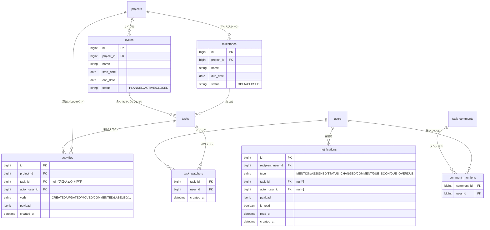

# Phase 2 M3 基本設計: 協働・通知・リアルタイム・計画

Phase 2 のマイルストーン M3 の基本設計。M1 のワークスペース境界・3 スコープ認可、M2 の日常 UX の上に、**チームで協働するための情報の流れ**を載せる。コメントの Markdown/編集/削除/@メンション、ウォッチャー、アクティビティ、アプリ内＋メール通知、リアルタイム更新、計画（サイクル/バックログ/マイルストーン）を対象とする。

- 関連: [Phase 2 要件定義](../../docs/phase2/requirements.md)（§5.6 コラボレーション・§5.7 計画・§10） / [M1 基本設計](./m1-workspace.md) / [M2 基本設計](./m2-daily-ux.md) / [ADR 0001 ワークスペース方式](../../docs/phase2/adr/0001-workspace-model.md)
- 前提（M1/M2 で確定済み）: 可視性・認可はワークスペース所属で決まる（非所属は 404）。認可集約点は `ProjectAccess.ResolveAccessAsync` / `WorkspaceAccess.ResolveWorkspaceAccessAsync`、一覧は `WhereVisibleTo` で SQL 段階から絞る。データアクセスは**生 SQL を使わず EF Core LINQ**。状態変更は `task_status_histories` に履歴を残す。スキーマ変更はマージ後にマイグレーション用 Lambda を手動実行。

> **ステータス: 📝 基本設計（実装はこれから）**。本書で方針を固め、M2 と同じく §15 のステップを PR 単位（各 PR で UT/E2E グリーン）で実装する。

---

## 目次

- [1. 目的と範囲](#1-目的と範囲)
- [2. データモデル](#2-データモデル)
- [3. コメント拡張（Markdown・編集/削除・@メンション）](#3-コメント拡張markdown編集削除メンション)
- [4. ウォッチャー](#4-ウォッチャー)
- [5. アクティビティ](#5-アクティビティ)
- [6. 通知（アプリ内・メール・期限）](#6-通知アプリ内メール期限)
- [7. リアルタイム更新](#7-リアルタイム更新)
- [8. 計画（サイクル／バックログ／マイルストーン）](#8-計画サイクルバックログマイルストーン)
- [9. 添付ファイル](#9-添付ファイル)
- [10. API 設計の変更](#10-api-設計の変更)
- [11. 画面への影響](#11-画面への影響)
- [12. マイグレーション方針](#12-マイグレーション方針)
- [13. 認可・可視性との関係](#13-認可可視性との関係)
- [14. テスト方針](#14-テスト方針)
- [15. 実装順序（M3 内の分解）](#15-実装順序m3-内の分解)
- [16. 未決事項](#16-未決事項)

---

## 1. 目的と範囲

M2 までで「タスクを速く正しく操作できる」状態になった。M3 は **「誰が何をしたか・何をすべきかが伝わる」「複数人が同じ画面で齟齬なく進められる」「期間・単位で計画できる」** を載せる。

M3 で作るもの：

- **コメント拡張**：Markdown 表示、編集/削除（論理削除）、**@メンション**（プロジェクトメンバー補完）
- **ウォッチャー**：タスクをフォローして更新通知を受ける。担当者・コメント投稿者・被メンション者は自動ウォッチ
- **アクティビティ**：タスク/プロジェクト単位のタイムライン（作成・更新・移動・コメント・ラベル変更 等）
- **通知**：アプリ内（ベル・未読数・既読化）＋メール（担当にされた・メンション・状態変更・期限が近い/超過）
- **リアルタイム更新**：複数人が同じ画面を見ているときの即時反映（まず SSE、WebSocket は後続）
- **計画**：サイクル（スプリント）＋バックログ、マイルストーン/リリース

### 1.1 既存資産の活用（作り直さない）

- コメントは Phase 1 からの `task_comments` を**拡張**する（Markdown・編集/削除・メンション）。
- アクティビティは既存 `task_status_histories`（状態遷移）を内包する一般化ストリームとして作る。当面は併存（表示は `activities` 優先）。
- 通知トリガは既存の担当・期限・状態変更・コメントを流用する。
- メール送信は既存の `IEmailSender`（本番は `LoggingEmailSender`）を使う。実送信（SES）は §16。

### 1.2 範囲外（M3 では作らない）

- コメントの同時編集の衝突解決（OT/CRDT）。リアルタイムは「他者の変更が自分の画面に反映される」までとする。
- 通知のユーザー個別 ON/OFF の細粒度設定（まずは種類固定）。
- 添付の高度機能（プレビュー・版管理）。添付自体の扱いは §9。

---

## 2. データモデル

### 2.1 変更の概要

| 区分 | テーブル | 変更 |
| --- | --- | --- |
| 追加 | `activities` | タスク/プロジェクト単位の活動ストリーム |
| 追加 | `task_watchers` | タスク × ウォッチャー（多対多） |
| 追加 | `notifications` | ユーザー宛のアプリ内通知 |
| 追加 | `comment_mentions` | コメント × 被メンションユーザー（多対多） |
| 追加 | `cycles` | サイクル（スプリント） |
| 追加 | `milestones` | マイルストーン/リリース |
| 変更 | `task_comments` | `updated_at`・`edited`（編集済み）・`deleted_at`（論理削除）を追加。本文は Markdown をそのまま保存 |
| 変更 | `tasks` | `cycle_id`（null=バックログ）、`milestone_id`（null 可）を追加 |

### 2.2 ER 図（M3 追加分）

### 2.3 制約・索引（主なもの）

- `task_watchers`：`(task_id, user_id)` 複合 PK。両 FK は `ON DELETE CASCADE`。
- `notifications`：索引 `(recipient_user_id, is_read, created_at)`。`task_id`/`actor_user_id` は `ON DELETE SET NULL`（対象が消えても通知履歴は残す）。
- `activities`：索引 `(project_id, created_at)`・`(task_id, created_at)`。`task_id` は `ON DELETE CASCADE`、`actor_user_id` は `RESTRICT`（監査性）。
- `comment_mentions`：`(comment_id, user_id)` 複合 PK。`ON DELETE CASCADE`。
- `cycles`/`milestones`：`project_id` に索引。`tasks.cycle_id`/`milestone_id` は `ON DELETE SET NULL`（サイクル削除でタスクはバックログへ戻る）。
- 文字列・列挙はこれまで同様 `CHECK` 制約で許容値を縛る（状態系と同方針）。

---

## 3. コメント拡張（Markdown・編集/削除・@メンション）

- **Markdown**：本文は Markdown のまま保存し、**表示側でサニタイズしてレンダリング**（XSS 対策。許可タグのホワイトリスト、`javascript:` 等を除去）。サーバは本文の整形をしない。
- **編集/削除**：`PATCH /api/tasks/{taskId}/comments/{id}`（本文更新、`edited=true`・`updated_at` 更新）、`DELETE …/{id}`（`deleted_at` による論理削除。表示は「削除されたコメント」）。編集/削除できるのは**投稿者本人**、削除は加えて Project OWNER / WS Admin も可。
- **@メンション**：入力時にプロジェクトメンバーを補完。保存時に本文中の有効なメンションを解決し `comment_mentions` に展開。解決できるのは**そのプロジェクトのメンバーのみ**（存在開示を避ける）。被メンション者へ通知を生成し、自動ウォッチに登録。

---

## 4. ウォッチャー

- `POST /api/tasks/{id}/watch` / `DELETE /api/tasks/{id}/watch`（本人のフォロー/解除）。参照は CanView、登録は CanView（自分を追加するだけ）で可。
- **自動ウォッチ**：タスクの担当にされた人、コメント投稿者、被メンション者を自動で `task_watchers` に追加（重複は無視）。
- タスク更新・コメント時、ウォッチャー（本人の操作分を除く）へ通知を生成する。取得は一括（N+1 回避）。

---

## 5. アクティビティ

- 記録ポイント：タスク作成/更新（担当・期限・優先度・ラベル・見積の変更）、状態移動（M2 の `move`）、コメント投稿、サイクル/マイルストーン割り当て。
- `verb` と `payload`（変更前後の要約）で表現。既存 `task_status_histories` は当面併存し、画面は `activities` を優先表示。
- `GET /api/tasks/{id}/activities`（タスク詳細のタイムライン）、`GET /api/projects/{id}/activities`（プロジェクトの最近の活動、ページング）。可視性は対象タスク/プロジェクトに従う。

---

## 6. 通知（アプリ内・メール・期限）

- **生成トリガ**：MENTION（メンション）、ASSIGNED（担当にされた）、STATUS_CHANGED（ウォッチ中タスクの状態変更）、COMMENT（ウォッチ中タスクへのコメント）、DUE_SOON/DUE_OVERDUE（期限）。自分自身の操作では自分に通知しない。
- **アプリ内**：`GET /api/me/notifications`（未読/既読・ページング）、`POST /api/me/notifications/{id}/read`、`POST /api/me/notifications/read-all`。ヘッダーのベルに未読数、一覧で既読化、クリックで対象タスクへ遷移。取得は本人分のみ。
- **メール**：`IEmailSender` 経由。M3 では**即時送信**を基本にし、内容はアプリ内通知と同一イベント。本番での実送信（SES）有効化は §16（当面は `LoggingEmailSender` のまま動作可能）。
- **期限通知**：日次のスケジュール実行で「期限が近い（例: 翌日まで）／超過」のタスクを拾い、担当・ウォッチャーへ生成。実行基盤は EventBridge + マイグレーション/バッチ用 Lambda を想定（§16）。重複送信を避けるため当日分の既存通知を確認してから生成。

---

## 7. リアルタイム更新

- 目的は「他者の変更が自分の画面に反映される」こと（同時編集の衝突解決は対象外）。
- **方式**：本番が API Gateway(HTTP)+Lambda のため、まず **SSE（Server-Sent Events）/ 軽量ポーリング**で通知・一覧・ボードの更新を反映する。WebSocket（API Gateway WebSocket）は必要性と運用コストを見て後続で判断（§16）。
- 最小実装：通知ベルの未読数とタスク一覧/ボードを、ウィンドウフォーカス時＋一定間隔で再取得（M2 の `onChanged` 再取得を流用）。SSE を足す場合はサーバのイベント配信を薄く追加。

---

## 8. 計画（サイクル／バックログ／マイルストーン）

- **サイクル（スプリント）**：`cycles`（プロジェクト単位）。`PLANNED/ACTIVE/CLOSED`。タスクに `cycle_id` を持たせ、**未割り当て＝バックログ**。CRUD は Project OWNER / WS Admin。
- **バックログ↔サイクル**：タスクの `cycle_id` を付け替える UI（一覧のドラッグ or 一括操作の流用）。サイクルの進捗（完了/全数、見積ポイント合計）を集計表示。
- **マイルストーン/リリース**：`milestones`（プロジェクト単位、`due_date`）。タスクに `milestone_id`。マイルストーン単位の進捗を集計。
- 計画単位は**プロジェクト単位**を基本とする（ワークスペース横断スプリントは当面対象外。必要なら後続で `workspace_id` 版を追加）。

---

## 9. 添付ファイル

- 要件（§5.6）にはあるが、本番が Lambda/Amplify 構成のため **M3 の最終ステップ（または M3 後）** に回す。
- 方式案：S3 への**署名付き URL 直アップロード**（API は発行と添付メタの登録のみ、本体は Lambda を経由しない）。`task_attachments`（`task_id`, `s3_key`, `file_name`, `content_type`, `size`, `uploaded_by`）。可視性はタスクに従う。
- M3 の必須スコープに含めるかは §16 で最終判断（含めない場合も設計の置き場所として本節を残す）。

---

## 10. API 設計の変更

いずれも EF Core LINQ で実装し、可視性・認可は既存集約点に載せる。

| 分類 | エンドポイント（例） |
| --- | --- |
| コメント | `PATCH /api/tasks/{taskId}/comments/{id}`, `DELETE …/{id}`（既存の一覧・投稿に追加） |
| ウォッチャー | `POST /api/tasks/{id}/watch`, `DELETE /api/tasks/{id}/watch`, `GET /api/tasks/{id}/watchers` |
| アクティビティ | `GET /api/tasks/{id}/activities`, `GET /api/projects/{id}/activities` |
| 通知 | `GET /api/me/notifications`, `POST /api/me/notifications/{id}/read`, `POST /api/me/notifications/read-all`, `GET /api/me/notifications/unread-count` |
| サイクル | `GET/POST /api/projects/{id}/cycles`, `PATCH/DELETE /api/cycles/{id}`, タスクの `cycle_id` 更新 |
| マイルストーン | `GET/POST /api/projects/{id}/milestones`, `PATCH/DELETE /api/milestones/{id}`, タスクの `milestone_id` 更新 |

既存の `TaskDto` は原則据え置き、追加情報（`cycleId`/`milestoneId` など）は影響範囲を見て段階的に足す（M2 で E2E の完全一致アサートが都度壊れた教訓から、DTO 形状変更は最小限にする）。

---

## 11. 画面への影響

- **タスク詳細**：アクティビティのタイムライン、ウォッチャー（フォロー/解除）、コメントの Markdown 表示・編集/削除・メンション入力補完、サイクル/マイルストーンの割り当て。
- **ヘッダー**：通知ベル（未読数・一覧・既読化）。コマンドパレット（M2）に通知/サイクルへのジャンプを追加する余地。
- **プロジェクト**：サイクル（スプリント）ボード、バックログ、マイルストーン一覧と進捗。
- **My Tasks / 一覧**：サイクル・期限に基づく見え方の補強（必要に応じて）。

---

## 12. マイグレーション方針

- M1/M2 と同様、EF Core マイグレーションを追加し、**マージ後にマイグレーション用 Lambda を手動実行**して有効化する（自動適用はしない）。各 PR で追加するテーブル/列は単体で後方互換（既存機能を壊さない）にする。
- `tasks` への `cycle_id`/`milestone_id` は NULL 許可で追加（既存タスクはバックログ/未割り当て扱い）。

---

## 13. 認可・可視性との関係

- 通知・アクティビティ・ウォッチャー・計画はすべて**対象タスク/プロジェクトの可視性**に従う（非所属は 404、配信しない）。通知は `recipient_user_id` 本人のみ取得可能。
- メンション可能な相手は**そのプロジェクトのメンバー**に限定。
- コメント編集は本人、削除は本人＋Project OWNER/WS Admin。サイクル/マイルストーンの管理は Project OWNER / WS Admin。
- 新規サービスも `ResolveAccessAsync` / `ResolveTaskAccessAsync` / `WhereVisibleTo` に載せ、判定を分散させない（M1 方針を継承）。

---

## 14. テスト方針

- **単体（xUnit）**：通知の生成条件（自己操作では生成しない・重複抑止）、自動ウォッチ、メンション解決（非メンバーは解決しない）、コメント編集/削除の権限、アクティビティ記録、計画の割り当て・集計、可視性（非所属は 404）。
- **E2E（Playwright）**：API（通知一覧/既読・ウォッチ・コメント編集・サイクル/マイルストーン CRUD）、画面（通知ベル・タイムライン・メンション入力・バックログ↔サイクル・マイルストーン進捗）。
- M2 と同様、各ステップの PR で UT/E2E をグリーンにしてからマージ。可視性・認可・通知生成条件を重点的に確認する。

---

## 15. 実装順序（M3 内の分解）

各ステップを単体で完成・デモ可能な PR にし、UT/E2E をグリーンにしてマージ（M1/M2 と同じ）。依存の少ない「記録 → 伝達 → 即時反映 → 計画」の順。

1. **アクティビティ基盤**：`activities` と記録ポイント、タスク詳細タイムライン
2. **コメント拡張**：Markdown 表示・編集/削除（論理削除）
3. **@メンション**：補完＋解決（`comment_mentions`）＋ハイライト
4. **ウォッチャー**：`task_watchers`、自動ウォッチ、フォロー/解除 UI
5. **アプリ内通知**：`notifications`、生成＋ベル UI・未読数・既読化
6. **メール通知**：`IEmailSender` 経由の即時送信（本番 SES 有効化は別途）
7. **期限通知**：スケジュール実行（EventBridge/バッチ）で DUE_SOON/DUE_OVERDUE 生成
8. **計画（サイクル/バックログ）**：`cycles`＋`cycle_id`、割り当て UI・進捗集計
9. **計画（マイルストーン）**：`milestones`＋`milestone_id`、進捗集計
10. **リアルタイム更新**：SSE/ポーリングで通知・一覧・ボードの即時反映
11. **（任意）添付ファイル**：S3 署名付き URL アップロード（§9・§16 の判断次第）
12. 各ステップのテスト（可視性維持・認可・通知生成条件・整合性を重点）

---

## 16. 未決事項

- **メール実送信**：本番は **Amazon SES で実送信する方針に決定**（step6）。`IEmailSender` を差し替え、設定 `Email:FromAddress` があれば `SesEmailSender`（SESv2）、無ければ `LoggingEmailSender`（開発・テスト・E2E）。本文のタスクリンクは `App:BaseUrl` から組み立て、通知生成（§6）に相乗りして即時送信。送信失敗はログに記録しリクエストは失敗させない。運用準備（コード外）：① SES で送信ドメイン/アドレス検証 ② サンドボックス解除 ③ Lambda 実行ロールに `ses:SendEmail` 許可 ④ `Email:FromAddress`・`App:BaseUrl` を環境変数/Secrets で設定。未設定ならログ出力へ自動フォールバック。
- **リアルタイム方式**：まず SSE/ポーリングで成立させ、WebSocket（API Gateway WebSocket）は必要性・運用コストを見てから。
- **添付ファイル**：M3 に含めるか、M3 最終ステップ or M3 後に回すか。含める場合は S3 署名付き URL 直アップロードを採用。
- **計画の単位**：プロジェクト単位を基本とする。ワークスペース横断スプリントの要望が出たら `workspace_id` 版を追加。
- **期限通知の基盤**：EventBridge + Lambda（定期実行）か、アプリ内バッチか。既存のマイグレーション用 Lambda 運用との整合を見て決める。
- **通知の粒度・集約**：まずは種類固定。同一対象の連続更新の集約（1 通化）やユーザー別 ON/OFF は要望次第で後続。
- **アクティビティと履歴の統合**：当面 `task_status_histories` と `activities` を併存（表示は `activities` 優先）。将来一本化するかは運用を見て判断。
