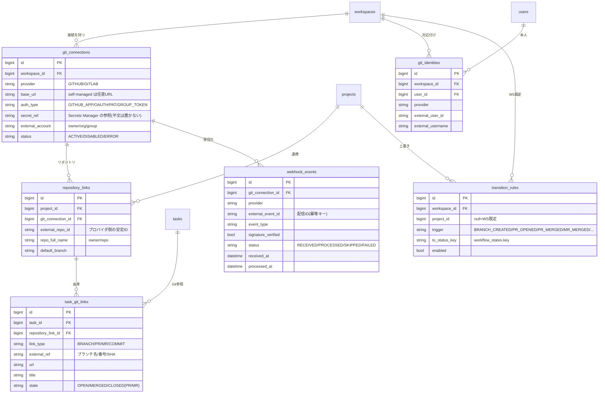

# Phase 2 M4 基本設計: Git 連携

Phase 2 のマイルストーン M4 の基本設計。M1 のワークスペース境界・3 スコープ認可、M2 の日常 UX、M3 の協働（アクティビティ・通知）の上に、**Git（GitHub / GitLab / self-managed GitLab）とタスクを結び、手作業のステータス更新を減らす**仕組みを載せる。プロバイダ抽象化、Webhook 受信（署名検証・冪等）、タスク自動遷移、双方向リンク、identity マッピングを対象とする。

- 関連: [Phase 2 要件定義](../../docs/phase2/requirements.md)（§5.8 Git 連携・§7 Git 連携要件・§10） / [M1 基本設計](./m1-workspace.md) / [M2 基本設計](./m2-daily-ux.md) / [M3 基本設計](./m3-collaboration.md) / [ADR 0001 ワークスペース方式](../../docs/phase2/adr/0001-workspace-model.md)
- 前提（M1〜M3 で確定済み）: 可視性・認可はワークスペース所属で決まる（非所属は 404）。認可集約点は `ProjectAccess.ResolveAccessAsync` / `WorkspaceAccess.ResolveWorkspaceAccessAsync`、一覧は `WhereVisibleTo` で SQL 段階から絞る。データアクセスは**生 SQL を使わず EF Core LINQ**。状態変更は `task_status_histories` に履歴を残し、`activities`（M3）にタイムラインを積む。スキーマ変更はマージ後にマイグレーション用 Lambda を手動実行。本番は API Gateway(HTTP)+Lambda、秘密情報は AWS Secrets Manager。

> **ステータス: 📝 基本設計（実装はこれから）**。本書で方針を固め、M2/M3 と同じく §15 のステップを PR 単位（各 PR で UT/E2E グリーン）で実装する。外部 Git プロバイダへの実呼び出しは、テストでは**フェイクアダプタ**で置き換える（§14）。

---

## 目次

- [1. 目的と範囲](#1-目的と範囲)
- [2. データモデル](#2-データモデル)
- [3. プロバイダ抽象化（IGitProvider）](#3-プロバイダ抽象化igitprovider)
- [4. 接続・資格情報の管理](#4-接続資格情報の管理)
- [5. Webhook 受信（署名検証・冪等・イベント駆動）](#5-webhook-受信署名検証冪等イベント駆動)
- [6. identity マッピング](#6-identity-マッピング)
- [7. 双方向リンク](#7-双方向リンク)
- [8. タスク自動遷移](#8-タスク自動遷移)
- [9. API 設計の変更](#9-api-設計の変更)
- [10. 画面への影響](#10-画面への影響)
- [11. マイグレーション方針](#11-マイグレーション方針)
- [12. 認可・可視性との関係](#12-認可可視性との関係)
- [13. セキュリティ](#13-セキュリティ)
- [14. テスト方針](#14-テスト方針)
- [15. 実装順序（M4 内の分解）](#15-実装順序m4-内の分解)
- [16. 未決事項](#16-未決事項)

---

## 1. 目的と範囲

M3 までで「速く正しく操作でき、協働の情報が流れる」状態になった。M4 は **「Git 上の出来事がタスクに自動で反映され、タスクと Git が双方向にリンクする」** を載せ、開発メンバーが手でステータスを更新する手間を減らす。

M4 で作るもの：

- **プロバイダ抽象化**：`IGitProvider` で GitHub / GitLab の差異（Webhook 署名方式・API・認証）をアダプタで吸収する。接続先はベース URL 設定可で **self-managed GitLab（オンプレ）** に対応
- **接続・資格情報の管理**：ワークスペース単位で Git 接続を設定。資格情報は **Secrets Manager に保管**し DB には参照（`secret_ref`）のみ。権限は最小、ワークスペース単位で分離
- **Webhook 受信**：署名検証・冪等処理・イベント駆動で受け取る（再送・順序入れ替わりに耐える）
- **identity マッピング**：Git ユーザーとアプリメンバーを対応付け、活動を正しく帰属させる
- **双方向リンク**：タスク⇄ブランチ/PR・MR/コミット。`Closes #123` 等でタスク自動クローズ、タイムラインにコミット/PR/パイプライン結果を表示
- **タスク自動遷移**：ブランチ作成→進行中、PR/MR 作成→レビュー中、マージ→完了。**遷移ルールはワークスペース/プロジェクト単位で設定可能**

### 範囲外（M4 では作らない）

- Bitbucket 等 GitHub/GitLab 以外のホスティング（抽象化で将来対応可能にはする）
- 開発指標の可視化（サイクルタイム等）は **M5**
- コードレビュー機能そのもの（PR はプロバイダ側で行う。本アプリは状態を取り込むだけ）
- 同時編集の衝突解決

---

## 2. データモデル

M1〜M3 の `workspaces` / `projects` / `tasks` / `users` / `activities` / `notifications` に、Git 連携のためのテーブルを追加する。既存テーブルは原則据え置き、`tasks` への影響は持たせない（リンクは独立テーブルで表現）。

| 区分 | テーブル | 役割 |
| --- | --- | --- |
| 追加 | `git_connections` | ワークスペース単位の Git 接続（プロバイダ・ベース URL・認証種別・`secret_ref`） |
| 追加 | `repository_links` | プロジェクト⇄リポジトリの対応（1 プロジェクトに複数リポジトリ可） |
| 追加 | `git_identities` | Git ユーザー⇄アプリメンバーの対応（identity マッピング） |
| 追加 | `task_git_links` | タスク⇄ブランチ/PR/MR/コミットの双方向リンク |
| 追加 | `webhook_events` | 受信 Webhook の記録（冪等・署名検証結果・監査） |
| 追加 | `transition_rules` | 自動遷移ルール（WS/プロジェクト単位、トリガ→遷移先状態） |



### 2.1 制約・索引（主なもの）

- `git_connections`：`workspace_id` に索引。`secret_ref` は参照のみ（**資格情報の平文は DB に置かない**）。`(workspace_id, provider, external_account)` で重複接続を抑止。
- `repository_links`：`(git_connection_id, external_repo_id)` で一意。`project_id` に索引。`project_id`/`git_connection_id` は `ON DELETE CASCADE`。
- `git_identities`：`(workspace_id, provider, external_user_id)` で一意。`user_id` は `ON DELETE CASCADE`。1 メンバーがプロバイダごとに 1 対応。
- `task_git_links`：`(repository_link_id, link_type, external_ref)` で一意（同じ PR の多重登録を防ぐ）。`task_id` に索引、`ON DELETE CASCADE`。
- `webhook_events`：`(git_connection_id, external_event_id)` で一意（**冪等キー**）。`received_at` に索引。ペイロードは要約のみ保持（巨大 JSON は保持しない）。
- `transition_rules`：`(project_id, trigger)` / `(workspace_id, trigger)` に索引。プロジェクト行があれば WS 既定を上書き。
- 文字列・列挙はこれまで同様 `CHECK` 制約で許容値を縛る。

---

## 3. プロバイダ抽象化（IGitProvider）

GitHub と GitLab の差異を 1 つのインターフェイスに吸収する。実装は `GitHubProvider` / `GitLabProvider`、テストは `FakeGitProvider`（§14）。

```csharp
public interface IGitProvider
{
    string Key { get; } // "GITHUB" / "GITLAB"

    // Webhook 署名検証（プロバイダごとに方式が異なる）
    bool VerifySignature(GitWebhookRequest request, string signingSecret);

    // Webhook ペイロードを共通イベントへ正規化
    GitEvent? ParseEvent(GitWebhookRequest request);

    // API 操作（双方向リンク用）。資格情報は ITokenProvider 経由で取得
    Task<GitRef> CreateBranchAsync(RepositoryRef repo, string branchName, string fromRef, CancellationToken ct);
    Task<GitPullRequest> CreatePullRequestAsync(RepositoryRef repo, CreatePrInput input, CancellationToken ct);
    Task<IReadOnlyList<GitRepository>> ListRepositoriesAsync(GitConnectionRef conn, CancellationToken ct);
}
```

- **正規化イベント `GitEvent`**：`{ Type(BranchCreated/PrOpened/PrMerged/PrClosed/Push/PipelineSucceeded/...), Repo, Actor(external user), Refs(branch/PR番号/SHA), TaskHints(本文/ブランチ名から抽出した参照) }`。遷移エンジンとリンク処理はこの共通型だけを見る。
- **差異の吸収例**：署名ヘッダ（GitHub: `X-Hub-Signature-256` HMAC-SHA256 / GitLab: `X-Gitlab-Token` 比較）、PR と MR の用語、ページング、リポジトリ ID の持ち方。
- **ベース URL**：self-managed GitLab はコンストラクション時に `base_url` を受けて API/認証先を切り替える。

---

## 4. 接続・資格情報の管理

- **保管場所**：資格情報（GitHub App 秘密鍵、OAuth/PAT、GitLab トークン）は **AWS Secrets Manager**。DB の `git_connections.secret_ref` は Secrets Manager の名前/ARN のみを持つ。オンプレは外部シークレット（環境変数/ファイル）に委譲できるよう `ISecretStore` で抽象化。
- **GitHub App（推奨）**：App の秘密鍵でアプリ JWT を作り、インストール ID からインストールトークン（短命）を発行。トークンは**メモリに短期キャッシュ**し、期限前に再発行。`ITokenProvider` が接続種別ごとにトークン取得を担う。
- **代替**：GitHub OAuth/PAT、GitLab は Project/Group アクセストークンまたは OAuth。
- **最小権限・分離**：読み取り中心＋双方向操作に必要な範囲のみ。**資格情報はワークスペース単位で分離**（別 WS の接続で他 WS のリポジトリを操作できない）。
- **接続状態**：疎通確認で `status` を `ACTIVE/ERROR` に更新し、画面に表示。

---

## 5. Webhook 受信（署名検証・冪等・イベント駆動）

- **受信口**：`POST /api/git/webhooks/{provider}`（`{provider}` は github/gitlab）。外部プロバイダが直接叩くため **BFF を経由しない**公開エンドポイントとし、**認証クッキーではなく署名検証**で正当性を担保する。CSRF 対策の対象外（Cookie を使わないため）。
- **接続の特定**：ペイロード（リポジトリ/インストール ID 等）から対象 `git_connections` を引き、その `secret_ref` の署名シークレットで検証する。
- **署名検証**：プロバイダ別（§3）。失敗は `401` で破棄し、`webhook_events` に `signature_verified=false, status=FAILED` を記録。
- **冪等処理**：配信 ID（GitHub `X-GitHub-Delivery` / GitLab は配信ヘッダ or ペイロードから算出したハッシュ）を `(git_connection_id, external_event_id)` 一意制約で重複排除。既存なら `SKIPPED` で `200` を返す（**再送に強い**）。
- **順序入れ替わり耐性**：イベントは「現在の事実」を上書き適用（PR state はイベントの最終状態で `task_git_links.state` を更新）。古いイベントが後に来ても状態が巻き戻らないよう、タイムスタンプ比較で新しい方を優先。
- **処理方式**：Lambda(HTTP) 上ではまず**受信同期処理**（検証→記録→正規化→適用）。重い処理や大量再送に備え、将来 **SQS による非同期化**を選べる口を設計に残す（§16）。処理は短時間で完了するものに限定。
- **監査**：すべての受信を `webhook_events` に記録（成功/スキップ/失敗）。本文そのものは保持せず要約のみ。

---

## 6. identity マッピング

- **目的**：Webhook の `actor`（Git ユーザー）をアプリメンバーへ対応付け、自動遷移やタイムラインを正しい人に帰属させる。
- **データ**：`git_identities(workspace_id, user_id, provider, external_user_id, external_username)`。
- **対応付け**：
  - 手動：ワークスペース設定でメンバーごとに Git ユーザー名を登録。
  - 自動補助：メールやユーザー名の一致で候補を提示（確定は人が行う）。
- **未マッピング時**：遷移やリンクは行うが、帰属は「外部ユーザー名（未対応）」として表示し、通知の宛先には使わない。後から対応付けると過去の表示も解決される（表示時に解決）。

---

## 7. 双方向リンク

- **タスク→Git**：タスクから**ブランチ作成**・**PR/MR 作成**（`IGitProvider` 経由）。ブランチ名は規約（例 `feature/{taskId}-{slug}`）で採番し、`task_git_links(BRANCH)` を記録。
- **Git→タスク**：
  - **参照の抽出**：コミットメッセージ・PR/MR 本文・ブランチ名から `#{taskId}` や `TASK-{id}`、`Closes #123` 等を正規表現で抽出（`GitEvent.TaskHints`）。該当タスクに `task_git_links` を作成。
  - **自動クローズ**：`Closes/Fixes #123` を含む PR/MR がマージされたら、該当タスクを完了へ遷移（§8 のルールに従う）。
- **タイムライン表示**：`task_git_links` と `activities`（Git 由来の新 verb: `GIT_BRANCH_CREATED` / `GIT_PR_OPENED` / `GIT_PR_MERGED` / `GIT_COMMIT_LINKED` / `GIT_PIPELINE` 等）で、タスク詳細にコミット/PR/パイプライン結果を時系列表示。
- **重複防止**：`(repository_link_id, link_type, external_ref)` 一意で同じ PR の二重登録を防ぐ。状態（OPEN/MERGED/CLOSED）はイベントで更新。

---

## 8. タスク自動遷移

- **ルール**：`transition_rules(trigger → to_status_key, enabled)`。プロジェクト行があれば WS 既定を上書き。既定の初期値：
  - `BRANCH_CREATED` → 進行中（カテゴリ IN_PROGRESS の既定状態）
  - `PR_OPENED` / `MR_OPENED` → レビュー中
  - `PR_MERGED` / `MR_MERGED` → 完了（カテゴリ DONE）
- **適用**：Webhook → 正規化イベント → 対象 `repository_link` → プロジェクト → 参照タスク → 適用可能ルール → **既存の移動処理（M2 `TaskService.Move`）を再利用**して状態遷移。履歴（`task_status_histories`）と活動（`activities`）を残し、ウォッチャーへ通知（M3）。
- **遷移先の解決**：`to_status_key` はそのワークスペースの `workflow_states.key`。存在しない/無効なキーはルールを無効扱いにし、記録を残す。
- **冪等**：同じイベントの再送では状態は既に目的値のため実質 no-op（§5 の冪等と合わせて二重遷移を防ぐ）。
- **帰属**：遷移の actor は identity マッピングで解決した本人。未対応時はシステム帰属＋外部ユーザー名を併記。

---

## 9. API 設計の変更

| 区分 | エンドポイント | 認可 |
| --- | --- | --- |
| Git 接続 | `GET/POST /api/workspaces/{id}/git-connections`、`PATCH/DELETE /api/git-connections/{id}`、`POST /api/git-connections/{id}/test` | WS Admin |
| リポジトリ連携 | `GET/POST /api/projects/{id}/repository-links`、`DELETE /api/repository-links/{id}`、`GET /api/git-connections/{id}/repositories` | Project OWNER / WS Admin |
| identity | `GET/POST /api/workspaces/{id}/git-identities`、`DELETE /api/git-identities/{id}` | WS Admin（本人の自己登録は検討：§16） |
| 遷移ルール | `GET/PUT /api/workspaces/{id}/transition-rules`、`GET/PUT /api/projects/{id}/transition-rules` | WS Admin / Project OWNER |
| タスク→Git | `POST /api/tasks/{id}/git/branch`、`POST /api/tasks/{id}/git/pull-request`、`GET /api/tasks/{id}/git/links` | CanWrite / CanView |
| Webhook | `POST /api/git/webhooks/{provider}` | 署名検証のみ（公開・BFF 非経由） |

- 既存 DTO（`TaskDto` 等）は原則据え置き。Git リンクは `GET /api/tasks/{id}/git/links` で別取得し、M2/M3 で確立した「完全一致アサートを壊さない」方針を守る。
- 資格情報（トークン・秘密鍵）は**レスポンスに含めない**。接続は種別・状態・`external_account` のみ返す。

---

## 10. 画面への影響

- **ワークスペース設定**：Git 接続の一覧・追加・疎通確認・削除。identity マッピング（メンバー⇄Git ユーザー）。遷移ルールの既定編集。
- **プロジェクト設定**：連携リポジトリの追加/解除、プロジェクト単位の遷移ルール上書き。
- **タスク詳細**：Git リンク（ブランチ/PR/MR/コミット）セクションと、タイムラインへの Git アクティビティ表示。「ブランチ作成」「PR 作成」アクション。
- すべて日本語ラベル。資格情報の入力欄は秘匿表示、保存後は値を再表示しない（参照のみ）。

---

## 11. マイグレーション方針

- 追加テーブル（§2）は EF Core のマイグレーションで作成。マージ後にマイグレーション用 Lambda を手動実行（M1〜M3 と同じ）。
- 既存テーブルへの破壊的変更なし。`tasks` へカラムを増やさない（リンクは別テーブル）。
- 資格情報は **DB に入れない**（Secrets Manager / 外部シークレット）。マイグレーションは参照（`secret_ref`）用の列のみ追加。

---

## 12. 認可・可視性との関係

- Git 接続は**ワークスペース資産**：参照/設定は WS Admin。リポジトリ連携・遷移ルール上書きは Project OWNER（または WS Admin）。非所属は 404（既存方針）。
- Webhook 由来の変更も**ワークスペース境界を越えない**：接続の WS に属するプロジェクトのタスクだけを対象にする。
- Git リンクの参照は、そのタスクの `CanView`（= プロジェクト可視性）に従う。
- 自動遷移・自動クローズは既存の移動処理を通すため、ワークフロー整合性（有効な `status` か）は従来どおりサービス層 LINQ で担保。

---

## 13. セキュリティ

- **署名検証必須**：Webhook はプロバイダ別の署名で検証し、失敗は破棄＋記録。
- **冪等・リプレイ耐性**：配信 ID の一意制約で重複を排除（§5）。
- **資格情報の保護**：Secrets Manager に保管、DB 平文禁止、レスポンス非返却、最小権限、WS 単位分離。IAM は `secretsmanager:GetSecretValue` を該当シークレットに限定。
- **公開エンドポイントの保護**：`POST /api/git/webhooks/{provider}` は Cookie 非使用（BFF 非経由）。署名検証・サイズ上限・レート考慮・不正ペイロードの安全な失敗。
- **SSRF 配慮**：self-managed のベース URL は許可リスト/形式検証を行い、内部ネットワークへの不正アクセスを防ぐ。
- Phase 1/既存のセキュリティ（BFF・CSP nonce・レート制限・監査）は維持。Git 操作・接続変更は監査対象（`activities` / `webhook_events`）。

---

## 14. テスト方針

- **単体（xUnit）**：署名検証（正/改ざん/欠落）、イベント正規化（GitHub/GitLab の実ペイロード断片）、参照抽出（`Closes #123` 等の正規表現）、遷移エンジン（ルール適用・無効キー・冪等）、identity 解決、認可（WS Admin/OWNER/非所属 404）。外部 API は `FakeGitProvider` と `ISecretStore` のフェイクで差し替え、**実ネットワークに出ない**。
- **E2E（Playwright）**：
  - API：Webhook 受信（署名 OK/NG・冪等な再送で二重遷移しない）、接続/リポジトリ/identity/遷移ルールの CRUD と認可、タスク→ブランチ/PR 作成（フェイクプロバイダ経由）。
  - 画面：Git 接続設定、リポジトリ連携、タスク詳細の Git リンク/タイムライン表示、遷移ルール編集。
  - Webhook はテスト内から正規ペイロード＋正しい署名を生成して POST し、タスクの自動遷移を検証する。
- M2/M3 で確立した**完全一致アサート維持**（Git 情報は別エンドポイント）と、**Postgres 実 DB での検証**を踏襲。

---

## 15. 実装順序（M4 内の分解）

各ステップを単体で完成・デモ可能な PR にし、UT/E2E をグリーンにしてマージ（M1〜M3 と同じ）。依存の少ない「土台 → 受信 → 対応付け → リンク → 遷移 → 能動操作 → 本番認証 → 設定 UI」の順。

1. **土台**：データモデル（§2 の 6 テーブル）＋`IGitProvider`/`GitEvent` 抽象と `FakeGitProvider`、接続/リポジトリ連携の最小 CRUD（認可込み）
2. **Webhook 受信基盤**：`POST /api/git/webhooks/{provider}`、署名検証・冪等（`webhook_events`）・正規化。まだ遷移はせず記録のみ
3. **identity マッピング**：`git_identities` CRUD・自動候補・UI、actor 解決
4. **双方向リンク（取り込み）**：参照抽出・`task_git_links`・タスク詳細のタイムライン表示（Git アクティビティ）
5. **タスク自動遷移**：`transition_rules`（WS/プロジェクト）＋遷移エンジン（既存 Move 再利用）、履歴/活動/通知
6. **タスク→Git 能動操作**：ブランチ作成・PR/MR 作成（フェイク→実アダプタ）、`Closes #123` 自動クローズ
7. **GitHub App 認証**：インストールトークン・Secrets Manager 連携・Terraform（シークレット/IAM/Webhook ルート）
8. **GitLab / self-managed 対応**：ベース URL 切替・トークン認証・署名方式（SSRF 配慮）
9. **設定 UI 仕上げ**：接続/リポジトリ/identity/遷移ルールの画面を整え、エラー表示・疎通確認
10. 各ステップのテスト（署名・冪等・認可・遷移・帰属・可視性を重点）

---

## 16. 未決事項

- **ADR 化**：プロバイダ抽象化と GitHub App 採用は要件で方向が決まっているが、`IGitProvider` の境界や Webhook 同期/非同期の判断は **ADR 0002** として別途残すか検討。
- **非同期化**：Lambda 同期処理の限界（大量再送・重いイベント）が見えたら SQS + ワーカー Lambda へ。本設計は切替口（イベント記録と処理の分離）を残す。
- **identity 自己登録**：メンバー本人による Git ユーザー自己登録を許すか（WS Admin 承認制にするか）。
- **ブランチ命名規約**：既定の命名と、プロジェクト単位でのカスタムを許すか。
- **パイプライン/CI の取り込み範囲**：成功/失敗の表示までか、遷移トリガにもするか。
- **ローカル/テスト環境での Webhook**：本番は API Gateway ルート。ローカルは E2E 内 POST で代替（外部トンネルは使わない）。
