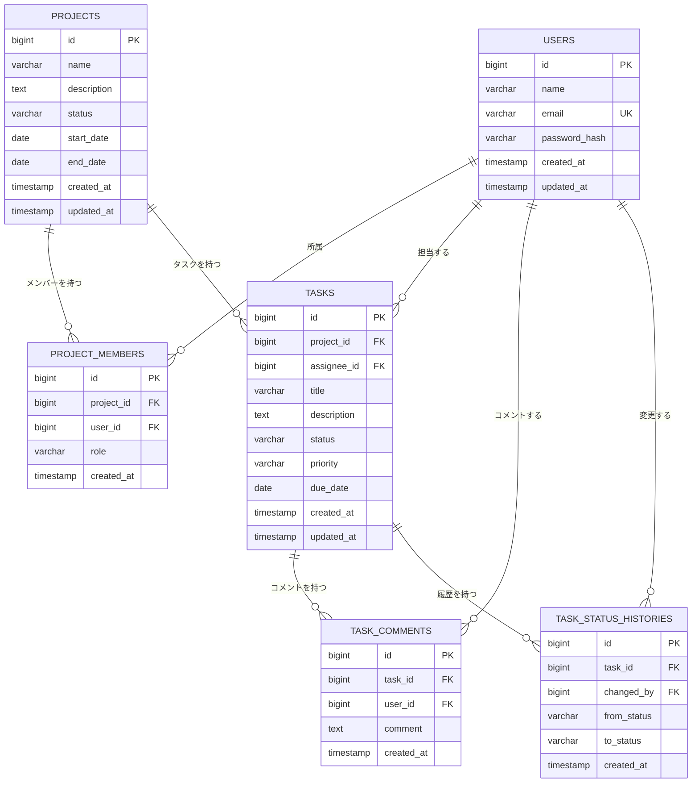

# 案件・タスク管理システム ER図・データベース設計

## 1. 文書情報

| 項目     | 内容                        |
| ------ | ------------------------- |
| 文書名    | 案件・タスク管理システム ER図・データベース設計 |
| バージョン  | 1.0                       |
| 作成日    | 2026-09-22                |
| 対象システム | 案件・タスク管理システム              |
| 上位文書   | 要件定義書 / 基本設計書             |
| DBMS   | PostgreSQL                |

---

# 2. データベース概要

本システムでは、ユーザー、プロジェクト、プロジェクトメンバー、タスク、コメント、タスクステータス履歴を管理する。

主要なテーブルは以下の6テーブルとする。

| テーブル名                 | 論理名        | MVP |
| --------------------- | ---------- | --- |
| users                 | ユーザー       | ○   |
| projects              | プロジェクト     | ○   |
| project_members       | プロジェクトメンバー | ○   |
| tasks                 | タスク        | ○   |
| task_comments         | タスクコメント    | ○   |
| task_status_histories | タスクステータス履歴 | △   |

`task_status_histories` は基本設計上のPhase 2機能であるため、MVPでは必須機能として使用しない。

---

# 3. ER図

## 3.1 Mermaid ER図

GitHub上で表示できるMermaid形式でER図を定義する。



---

# 4. テーブル構成

## 4.1 users

ユーザー情報を管理する。

| カラム           | 型            | NULL | 制約      | 説明         |
| ------------- | ------------ | ---- | ------- | ---------- |
| id            | BIGSERIAL    | NO   | PK      | ユーザーID     |
| name          | VARCHAR(100) | NO   | -       | ユーザー名      |
| email         | VARCHAR(255) | NO   | UNIQUE  | メールアドレス    |
| password_hash | VARCHAR(255) | NO   | -       | ハッシュ化パスワード |
| created_at    | TIMESTAMP    | NO   | DEFAULT | 作成日時       |
| updated_at    | TIMESTAMP    | NO   | DEFAULT | 更新日時       |

### 制約

* `id` を主キーとする
* `email` は一意とする
* `password_hash` に平文パスワードを保存しない

---

# 5. projects

プロジェクト情報を管理する。

| カラム         | 型            | NULL | 制約      | 説明       |
| ----------- | ------------ | ---- | ------- | -------- |
| id          | BIGSERIAL    | NO   | PK      | プロジェクトID |
| name        | VARCHAR(200) | NO   | -       | プロジェクト名  |
| description | TEXT         | YES  | -       | プロジェクト説明 |
| status      | VARCHAR(30)  | NO   | DEFAULT | プロジェクト状態 |
| start_date  | DATE         | YES  | -       | 開始日      |
| end_date    | DATE         | YES  | -       | 終了日      |
| created_at  | TIMESTAMP    | NO   | DEFAULT | 作成日時     |
| updated_at  | TIMESTAMP    | NO   | DEFAULT | 更新日時     |

### status

以下の値を使用する。

| 値         | 意味    |
| --------- | ----- |
| ACTIVE    | 稼働中   |
| COMPLETED | 完了    |
| ARCHIVED  | アーカイブ |

---

# 6. project_members

プロジェクトとユーザーの所属関係を管理する。

ユーザーとプロジェクトは多対多の関係になるため、中間テーブルとして使用する。

| カラム        | 型           | NULL | 制約      | 説明        |
| ---------- | ----------- | ---- | ------- | --------- |
| id         | BIGSERIAL   | NO   | PK      | メンバーID    |
| project_id | BIGINT      | NO   | FK      | プロジェクトID  |
| user_id    | BIGINT      | NO   | FK      | ユーザーID    |
| role       | VARCHAR(30) | NO   | DEFAULT | プロジェクト内権限 |
| created_at | TIMESTAMP   | NO   | DEFAULT | 登録日時      |

### role

| 値      | 意味         |
| ------ | ---------- |
| OWNER  | プロジェクト管理者  |
| MEMBER | プロジェクトメンバー |

### 制約

同じユーザーを同じプロジェクトへ重複登録できないようにする。

```text
UNIQUE(project_id, user_id)
```

---

# 7. tasks

プロジェクト内のタスクを管理する。

| カラム         | 型            | NULL | 制約      | 説明       |
| ----------- | ------------ | ---- | ------- | -------- |
| id          | BIGSERIAL    | NO   | PK      | タスクID    |
| project_id  | BIGINT       | NO   | FK      | プロジェクトID |
| assignee_id | BIGINT       | YES  | FK      | 担当ユーザーID |
| title       | VARCHAR(200) | NO   | -       | タスク名     |
| description | TEXT         | YES  | -       | タスク説明    |
| status      | VARCHAR(30)  | NO   | DEFAULT | タスク状態    |
| priority    | VARCHAR(30)  | NO   | DEFAULT | 優先度      |
| due_date    | DATE         | YES  | -       | 期限       |
| created_at  | TIMESTAMP    | NO   | DEFAULT | 作成日時     |
| updated_at  | TIMESTAMP    | NO   | DEFAULT | 更新日時     |

---

# 8. tasks.status

タスクの状態を管理する。

| 値           | 意味  |
| ----------- | --- |
| TODO        | 未着手 |
| IN_PROGRESS | 進行中 |
| DONE        | 完了  |

---

# 9. tasks.priority

タスクの優先度を管理する。

| 値      | 意味 |
| ------ | -- |
| LOW    | 低  |
| MEDIUM | 中  |
| HIGH   | 高  |

---

# 10. task_comments

タスクに対するコメントを管理する。

| カラム        | 型         | NULL | 制約      | 説明        |
| ---------- | --------- | ---- | ------- | --------- |
| id         | BIGSERIAL | NO   | PK      | コメントID    |
| task_id    | BIGINT    | NO   | FK      | タスクID     |
| user_id    | BIGINT    | NO   | FK      | コメント投稿者ID |
| comment    | TEXT      | NO   | -       | コメント本文    |
| created_at | TIMESTAMP | NO   | DEFAULT | 投稿日時      |

1つのタスクに対して複数のコメントを登録できる。

---

# 11. task_status_histories

タスクのステータス変更履歴を管理する。

本テーブルは基本設計上のPhase 2機能として使用する。

| カラム         | 型           | NULL | 制約      | 説明       |
| ----------- | ----------- | ---- | ------- | -------- |
| id          | BIGSERIAL   | NO   | PK      | 履歴ID     |
| task_id     | BIGINT      | NO   | FK      | タスクID    |
| changed_by  | BIGINT      | NO   | FK      | 変更ユーザーID |
| from_status | VARCHAR(30) | YES  | -       | 変更前ステータス |
| to_status   | VARCHAR(30) | NO   | -       | 変更後ステータス |
| created_at  | TIMESTAMP   | NO   | DEFAULT | 変更日時     |

初回ステータス設定時など、変更前のステータスが存在しない場合は `from_status` をNULLとする。

---

# 12. テーブル間リレーション

## 12.1 users - project_members

```text
users 1 --- N project_members
```

1人のユーザーは複数のプロジェクトに所属できる。

---

## 12.2 projects - project_members

```text
projects 1 --- N project_members
```

1つのプロジェクトには複数のユーザーを所属させることができる。

`users` と `projects` の多対多関係を `project_members` が解決する。

---

## 12.3 projects - tasks

```text
projects 1 --- N tasks
```

1つのプロジェクトには複数のタスクを登録できる。

各タスクは必ず1つのプロジェクトに所属する。

---

## 12.4 users - tasks

```text
users 1 --- N tasks
```

1人のユーザーが複数のタスクを担当できる。

タスクの担当者は未設定でもよいため、`assignee_id` はNULLを許可する。

---

## 12.5 tasks - task_comments

```text
tasks 1 --- N task_comments
```

1つのタスクに複数のコメントを登録できる。

---

## 12.6 users - task_comments

```text
users 1 --- N task_comments
```

1人のユーザーが複数のコメントを投稿できる。

---

## 12.7 tasks - task_status_histories

```text
tasks 1 --- N task_status_histories
```

1つのタスクに対して複数のステータス変更履歴を保持できる。

本機能はPhase 2で使用する。

---

## 12.8 users - task_status_histories

```text
users 1 --- N task_status_histories
```

1人のユーザーが複数のステータス変更を実施できる。

---

# 13. 外部キー設計

| 子テーブル                 | カラム         | 親テーブル    | カラム | 削除時      |
| --------------------- | ----------- | -------- | --- | -------- |
| project_members       | project_id  | projects | id  | CASCADE  |
| project_members       | user_id     | users    | id  | CASCADE  |
| tasks                 | project_id  | projects | id  | CASCADE  |
| tasks                 | assignee_id | users    | id  | SET NULL |
| task_comments         | task_id     | tasks    | id  | CASCADE  |
| task_comments         | user_id     | users    | id  | CASCADE  |
| task_status_histories | task_id     | tasks    | id  | CASCADE  |
| task_status_histories | changed_by  | users    | id  | CASCADE  |

### 削除方針

プロジェクトを削除した場合、そのプロジェクトに紐付くメンバーおよびタスクも削除する。

タスクを削除した場合、そのタスクに紐付くコメントおよびステータス履歴も削除する。

タスク担当者となっているユーザーを削除した場合、タスク自体は残し、`assignee_id` をNULLとする。

---

# 14. インデックス設計

大量データになった場合の検索性能を考慮し、以下のインデックスを設定する。

| テーブル                  | カラム         | 目的             |
| --------------------- | ----------- | -------------- |
| users                 | email       | ログイン時のユーザー検索   |
| project_members       | project_id  | プロジェクトメンバー検索   |
| project_members       | user_id     | ユーザー所属プロジェクト検索 |
| tasks                 | project_id  | プロジェクト内タスク検索   |
| tasks                 | assignee_id | 担当者別タスク検索      |
| tasks                 | status      | ステータス別検索       |
| tasks                 | due_date    | 期限による検索        |
| task_comments         | task_id     | タスクコメント検索      |
| task_status_histories | task_id     | ステータス履歴検索      |

`users.email` および `project_members(project_id, user_id)` の一意制約によるインデックスも利用する。

---

# 15. ダッシュボードのデータ設計

ダッシュボードはPhase 2の機能として実装する。

ダッシュボード専用テーブルは作成せず、既存のテーブルから集計する。

主に以下のデータを使用する。

```text
projects
tasks
users
```

例：

* プロジェクト数
* タスク総数
* 未着手タスク数
* 進行中タスク数
* 完了タスク数
* 期限が近いタスク
* 担当者別タスク数

これにより、不要な集計用テーブルを増やさずにダッシュボードを実装する。

---

# 16. タスク検索・絞り込みのデータ設計

タスク検索・絞り込みはPhase 2の機能として実装する。

専用テーブルは作成せず、`tasks` テーブルを検索する。

検索条件の例：

* タスク名
* ステータス
* 優先度
* 担当者
* プロジェクト
* 期限

EF Core / LINQによって条件を動的に組み立てる。

---

# 17. ステータス履歴のデータ設計

ステータス履歴はPhase 2で使用する。

タスクのステータスが変更された場合、以下の情報を記録する。

```text
変更前ステータス
      ↓
変更後ステータス
      ↓
変更ユーザー
      ↓
変更日時
```

例：

```text
TODO
 ↓
IN_PROGRESS
```

```text
IN_PROGRESS
 ↓
DONE
```

履歴を保持することで、タスクの状態変更を時系列で確認できる。

---

# 18. データ整合性

以下のルールによりデータ整合性を確保する。

## 18.1 プロジェクト

タスクは必ずプロジェクトに所属する。

```text
tasks.project_id NOT NULL
```

## 18.2 プロジェクトメンバー

同一ユーザーを同一プロジェクトへ複数回登録できない。

```text
UNIQUE(project_id, user_id)
```

## 18.3 タスク担当者

担当者未設定を許可する。

```text
tasks.assignee_id NULL
```

## 18.4 コメント

コメントは必ずタスクおよびユーザーに紐付ける。

```text
task_comments.task_id NOT NULL
task_comments.user_id NOT NULL
```

## 18.5 ステータス履歴

変更後ステータスは必須とする。

```text
task_status_histories.to_status NOT NULL
```

---

# 19. 命名規則

データベースの命名規則は以下とする。

## 19.1 テーブル

小文字のスネークケースを使用する。

```text
users
projects
project_members
task_comments
```

## 19.2 カラム

小文字のスネークケースを使用する。

```text
created_at
updated_at
project_id
assignee_id
```

## 19.3 主キー

各テーブルの主キーは `id` とする。

## 19.4 外部キー

参照先テーブル名 + `_id` を基本とする。

例：

```text
project_id
user_id
task_id
```

---

# 20. PostgreSQL設計方針

DBMSにはPostgreSQLを使用する。

主キーには基本的に連番型を使用する。

例：

```sql
BIGSERIAL
```

日時は以下のカラムで管理する。

```text
created_at
updated_at
```

日付のみを扱う項目には `DATE` を使用する。

例：

```text
start_date
end_date
due_date
```

---

# 21. Entity Framework Coreとの対応

各テーブルはEntity Framework CoreのEntityとして管理する。

想定Entity：

```text
User
Project
ProjectMember
Task
TaskComment
TaskStatusHistory
```

Entity間のリレーションはEF CoreのNavigation PropertyおよびForeign Keyによって定義する。

例：

```text
Project
 ├── ProjectMembers
 └── Tasks

Task
 ├── Project
 ├── Assignee
 ├── Comments
 └── StatusHistories
```

---

# 22. MVPとDB設計の関係

MVPでは以下のテーブルを主に使用する。

```text
users
projects
project_members
tasks
task_comments
```

`task_status_histories` はテーブル自体を先に定義するが、MVPでは必須機能として実装しない。

これにより、MVPの実装範囲を抑えつつ、Phase 2以降の機能拡張に対応できる構成とする。

---

# 23. DB設計完了条件

以下を満たした時点でER・DB設計を完了とする。

* [ ] 全テーブルが定義されている
* [ ] 各テーブルの主キーが定義されている
* [ ] 外部キーが定義されている
* [ ] テーブル間のリレーションが定義されている
* [ ] 必須項目が定義されている
* [ ] 一意制約が定義されている
* [ ] ステータス・優先度等の値が定義されている
* [ ] インデックス方針が定義されている
* [ ] 削除時の動作が定義されている
* [ ] MVPとPhase 2以降のDB利用範囲が整理されている
* [ ] PostgreSQLで実装可能な構成になっている
* [ ] Entity Framework Coreでマッピング可能な構成になっている

---

# 24. 次工程

ER・DB設計完了後、以下を作成する。

```text
docs/database/ddl.sql
```

その後、API詳細設計を行う。

```text
docs/design/api-specification.md
```

API詳細設計では、各エンドポイントについて以下を定義する。

* HTTPメソッド
* URL
* 認証要否
* リクエスト
* バリデーション
* 正常レスポンス
* エラーレスポンス
* HTTPステータスコード
* DBアクセス
* 権限チェック
